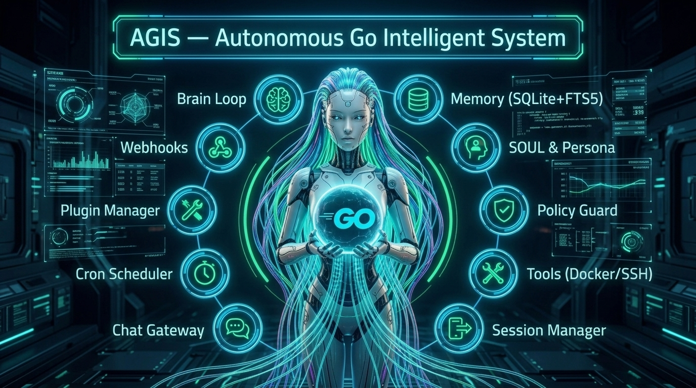

# AGIS — Autonomous Go Intelligent System

<p align="center">
  
</p>

<p align="center">
  <a href="https://go.dev"></a>
  <a href="LICENSE"></a>
  <a href="https://github.com/SalvucciFacundo/agis/releases"></a>
  <a href="https://github.com/SalvucciFacundo/agis/actions/workflows/ci.yml"></a>
  <a href="docs/roadmap.md"></a>
  <a href="https://github.com/SalvucciFacundo/agis"></a>
</p>

<p align="center">
  <b>General-Purpose Autonomous AI Agent & Cognitive Engine built in pure Go.</b><br>
  <i>Single static binary, SQLite + FTS5 persistent memory, skills & persona evolution, policy guard, and multi-surface chat gateways.</i>
</p>

---

## 🏷️ Topics & Keywords
`golang` • `ai-agent` • `autonomous-agents` • `llm` • `mcp` • `model-context-protocol` • `ollama` • `openai` • `bubbletea` • `tui` • `sqlite` • `fts5` • `telegram-bot` • `discord-bot` • `cron` • `plugins` • `webhooks` • `hexagonal-architecture` • `hermes-agent` • `spec-driven-development`

---

## 🚀 Quick Start & Installation

AGIS is distributed as a single static binary with zero external runtime dependencies. Choose your preferred installation method:

### 1. Automatic One-Line Installer (Linux & macOS)
```bash
curl -fsSL https://raw.githubusercontent.com/SalvucciFacundo/agis/main/install.sh | bash
```
*Auto-detects Debian, Ubuntu, Arch, Fedora, Alpine, CentOS, Rocky Linux, openSUSE, and macOS (Apple Silicon & Intel).*

### 2. Windows (PowerShell Installer)
```powershell
iwr -useb https://raw.githubusercontent.com/SalvucciFacundo/agis/main/install.ps1 | iex
```
*Compatible with PowerShell 5.1 and PowerShell 7+ (pwsh).*

### 3. 🐧 Linux Native Packages & Prebuilt Binaries
Download native packages directly from [GitHub Releases](https://github.com/SalvucciFacundo/agis/releases):

- **Debian / Ubuntu / Mint / Pop!_OS (`.deb`):** `sudo dpkg -i agis_*_linux_amd64.deb`
- **Fedora / RHEL / CentOS / Rocky (`.rpm`):** `sudo rpm -ivh agis_*_linux_amd64.rpm`
- **Alpine Linux (`.apk`):** `sudo apk add --allow-untrusted agis_*_linux_amd64.apk`
- **Arch Linux / Manjaro (`.pkg.tar.zst`):** `sudo pacman -U agis_*.pkg.tar.zst`
- **macOS Universal Binary:** Standalone `tar.gz` for both Apple Silicon (M1/M2/M3/M4) and Intel
- **Windows Executable:** `agis_*_windows_amd64.zip`

### 4. 🐹 Install via Go (Go 1.24+)
```bash
go install github.com/SalvucciFacundo/agis/cmd/agis@latest
```

### 5. 🛠️ Build from Source
```bash
# Clone the repository
git clone https://github.com/SalvucciFacundo/agis.git
cd agis

# Build static binary
make build

# Launch interactive TUI (defaults to local Ollama with llama3.2)
./bin/agis

# Or run directly without building
go run ./cmd/agis
```

---

## ✨ Core Capabilities & Architectural Pillars

- **🧠 Brain Thinking Loop** — `Brain.Step` persists turns, loads history, injects memory & skills, streams model tokens, evaluates tool calls, and handles up to 8 bounded tool rounds.
- **🔌 Multi-Provider LLM & Resilience** — Ollama, OpenAI, OpenRouter, and any OpenAI-compatible API over a unified client with streaming SSE, multi-key credential pooling with reactive HTTP 429 rotation, ordered fallback provider chains with pre-token failover, and independent auxiliary model overrides (memory, vision, audio, embeddings).
- **💾 SQLite + FTS5 & Hybrid Search** — Pure Go SQLite with full-text search and dense vector embeddings (Ollama / OpenAI) combined via Reciprocal Rank Fusion (RRF).
- **🔄 Learning & Memory Loop** — Continuous observation extraction (Curator), session summarization, and user model confidence synthesis.
- **🎭 Skill Hub & Persona** — Agentskills.io-compatible Markdown skill loading, runtime skill distillation, durable `SOUL.md`, and dynamic personality overlays.
- **🛡️ Policy Guard & Tool Backends** — Multi-tier security postures (`sandbox`, `standard`, `full`), fail-closed approval, audit logging, and Local/Docker/SSH tool backends.
- **🌐 Native Web Search & Content Extraction** — Pure Go multi-provider search (DuckDuckGo, Brave, Tavily, SearXNG) and safe HTML-to-Markdown extractor with SSRF prevention and size guards.
- **🔌 Model Context Protocol (MCP) Client** — Native JSON-RPC 2.0 client supporting `stdio` subprocesses with process group isolation and `sse` network streams, dynamic tool discovery, and Policy Guard integration.
- **🖼️ Multimodal Ingestion (Vision & Audio)** — Native vision multipart content formatting (Data URLs) and audio speech-to-text (OpenAI Whisper) across Telegram, Discord, and core Brain turns.
- **💬 Chat Gateway Multiplexer** — Concurrent Telegram and Discord bot adapters, user allowlists, session multiplexing, and message chunking.
- **⏱️ Cron Scheduler Daemon** — Autonomous scheduled tasks with 5-field cron and `@every` duration expressions, sandbox policy, and chat notification delivery.
- **🧩 Plugin Manager** — Dynamic external plugin discovery (`plugin.json`), stdio tool runner bridge, skill extraction, and persistent state management.
- **🔗 HMAC Webhook Server** — HTTP event listener with constant-time HMAC-SHA256 signature verification and brain event dispatching.
- **🤖 Native Subagent Delegation** — Spawns isolated, ephemeral child agents (`delegate_task`) with bounded execution loops, ephemeral state isolation, global concurrency limits, timeout propagation, and Policy Guard gating.

---

## 🖥️ Interactive TUI & Slash Commands

Launch the terminal interface with `./bin/agis`. You can manage sessions, switch personas, and inspect security rules using slash commands:

| Command | Category | Description |
|---|---|---|
| `/new` or `/reset` | Sessions | Starts a fresh session, resetting turn state while preserving database history. |
| `/save` | Sessions | Explicitly persists the active conversation session in SQLite. |
| `/list` | Sessions | Browses recent conversations with IDs, creation timestamps, and message counts. |
| `/restore <id>` | Sessions | Restores a previous session by ID and reloads conversation history into view. |
| `/rename <title>` | Sessions | Renames the current conversation title (prompt-injection safe). |
| `/snapshot` | Sessions | Takes an immutable point-in-time copy of conversation history. |
| `/compress` | Sessions | Triggers early context summarization on long conversations. |
| `/personality <preset>` | Persona | Switches session voice (`concise`, `teacher`, `technical`, `creative`, custom). |
| `/persona status` | Persona | Displays active persona, `SOUL.md` identity, and evolution status. |
| `/permisos` | Security | Opens the interactive Policy Guard panel (toggle rules, change postures, audit trail). |

Full command guide in [docs/tui-commands.md](docs/tui-commands.md).

---

## 🌐 CLI Subcommands & Daemons

AGIS provides modular daemons and management subcommands alongside the default interactive TUI:

```bash
# 1. Chat Gateway (Telegram & Discord daemon)
./bin/agis gateway [run] [--config config.yaml]

# 2. Cron Scheduler Daemon
./bin/agis cron run [--config config.yaml]
./bin/agis cron list [--config config.yaml]

# 3. External Plugins Management
./bin/agis plugins list [--dir ~/.agis/plugins]
./bin/agis plugins enable <plugin_name>
./bin/agis plugins disable <plugin_name>
./bin/agis plugins inspect <plugin_name>

# 4. Webhook HTTP Listener
./bin/agis webhook run [--port 8080] [--host 127.0.0.1] [--path /webhook]

# 5. Policy Guard CLI
./bin/agis policy show
./bin/agis policy set <rule>
./bin/agis policy rm <rule>
./bin/agis policy tier <sandbox|standard>

# 6. Model Context Protocol (MCP) CLI
./bin/agis mcp list
./bin/agis mcp test <server> <tool> [json_args]

# 7. System Diagnostics & Health Probe
./bin/agis doctor [--json] [--no-color]

# 8. Conversation Session Management & Export
./bin/agis session list [--limit 20] [--json]
./bin/agis session show <id> [--json]
./bin/agis session delete <id> [--yes]
./bin/agis session rename <id> "<title>"
./bin/agis session export <id> [--format json|markdown|txt] [--output file]
./bin/agis session snapshot <id> [--json]

# 9. In-Place Self-Updater & Release Inspector
./bin/agis update [--check] [--backup] [--version <tag>] [--force]

# 10. Configuration Management & Inspection
./bin/agis config show [--json] [--reveal]
./bin/agis config get <key> [--reveal] [--json]
./bin/agis config set <key> <value>
./bin/agis config path
```

Full CLI reference in [docs/cli.md](docs/cli.md).

---

## ⚙️ Configuration Reference

Configuration lives in `~/.agis/config.yaml` (or `$AGIS_HOME/config.yaml`). Precedence: `-config <path>` > `AGIS_HOME` > `~/.agis/config.yaml`.

```yaml
llm:
  provider: ollama      # ollama | openai
  model: llama3.2
  # api_key: ""         # required for openai, empty for local ollama

db:
  path: /home/you/.agis/agis.db

memory:
  learning_enabled: true
  recall_limit: 10
  nudge_every: 10
  close_timeout: 30s

agent:
  personalities: {}
  evolution_enabled: true

skills:
  enabled: true
  dir: ~/.agis/skills

tools:
  enabled: false
  docker:
    enabled: false
    image: alpine:3
  ssh:
    enabled: false
    host: ""
    user: ""
    key_path: ""

gateway:
  enabled: false
  telegram:
    enabled: false
    token: ""
    allowlist: []
  discord:
    enabled: false
    token: ""
    allowlist: []

cron:
  enabled: false
  jobs:
    - name: "daily-health"
      schedule: "@every 1h"
      prompt: "Check system health"
      target:
        adapter: "telegram"
        recipient: "123456"

plugins:
  enabled: false
  dir: "~/.agis/plugins"

webhook:
  enabled: false
  port: 8080
  path: "/webhook"
  secret: ""
```

Full configuration specification in [docs/configuration.md](docs/configuration.md).

---

## 📚 Documentation

Detailed technical documentation and subsystem guides:

### Core & Architecture
- [docs/architecture.md](docs/architecture.md) — Hexagonal layout, domain ports, data flow, unified architecture
- [docs/configuration.md](docs/configuration.md) — Complete configuration schema, precedence, defaults, and examples
- [docs/roadmap.md](docs/roadmap.md) — Milestone history, shipped scopes, verification details, post-v1 backlog

### Interfaces & Commands
- [docs/cli.md](docs/cli.md) — Comprehensive CLI subcommands reference (`gateway`, `cron`, `plugins`, `webhook`, `policy`)
- [docs/tui-commands.md](docs/tui-commands.md) — Interactive slash commands (`/new`, `/save`, `/restore`, `/snapshot`, `/compress`, `/personality`, `/permisos`) and hotkeys

### Integrations & Ecosystem
- [docs/mcp.md](docs/mcp.md) — Model Context Protocol (MCP) Client guide (stdio/sse transports, tool discovery, Policy Guard)
- [docs/gateway.md](docs/gateway.md) — Multi-platform Chat Gateway guide (Telegram & Discord setup, chunking, allowlists)
- [docs/cron.md](docs/cron.md) — Autonomous Cron Scheduler guide (5-field syntax, interval macros, target delivery)
- [docs/plugins.md](docs/plugins.md) — External Plugin System guide (`plugin.json` schema, stdio bridge, state management)
- [docs/webhook.md](docs/webhook.md) — Webhook Event Ingestion guide (HMAC-SHA256 constant-time authentication, dispatch)

### Security, Memory & Persona
- [docs/permissions.md](docs/permissions.md) — Multi-tier Policy Guard (`sandbox`, `standard`, `full`), permission scopes, audit logging
- [docs/security.md](docs/security.md) — Threat model, defense-in-depth, prompt injection defense, sandbox invariants
- [docs/memory.md](docs/memory.md) — SQLite + FTS5 memory substrate, observation curation, session summarization, user model
- [docs/sessions.md](docs/sessions.md) — Session Manager lifecycle, conversation switching, point-in-time snapshots
- [docs/persona.md](docs/persona.md) — `SOUL.md` durable identity, dynamic personality overlays, guided evolution
- [docs/skills.md](docs/skills.md) — Skill Hub discovery, Markdown frontmatter specification, close-time skill distillation

---

## 🗺️ Roadmap & Shipped Milestones

| Milestone | Scope | State |
|---|---|---|
| **M1** | Brain loop, LLM port, SQLite+FTS5 memory, minimal TUI, config | **DONE ✅** |
| **M2** | Learning loop: curator, nudges, session summarization, user model | **DONE ✅** |
| **M3** | Skills & persona: skill hub, SOUL.md, persona overlays & evolution | **DONE ✅** |
| **M4** | Tools, backends & permissions: Policy Guard, `agis policy`, `/permisos` | **DONE ✅** |
| **M5** | Full TUI: slash commands, session browse, interrupt-and-redirect | **DONE ✅** |
| **M6** | Gateway (Telegram/Discord) + cron + plugins + webhooks | **DONE ✅** |
| **M7** | Hybrid search: SQLite vector BLOBs, embeddings, RRF | **DONE ✅** |
| **M8** | Model Context Protocol (MCP): JSON-RPC, stdio/sse, tool bridge | **DONE ✅** |

Full detail and post-v1 backlog in [docs/roadmap.md](docs/roadmap.md).

---

## 🤝 Relationship to GAIA and Hermes

- **GAIA** — architectural DNA. Hexagonal layout, Bubbletea TUI, SQLite persistence, skill registry. AGIS is **not** a fork: it is a general-purpose agent with its own codebase, memory DB, and no coding-specific machinery.
- **Hermes** — functional reference. Learning loop, skills, multi-provider, multi-backend, ecosystem integrations. AGIS reimplements that scope in Go at a fraction of the resource footprint.

---

## 🤝 Contributing

Contributions, issues, and feature requests are welcome! See [CONTRIBUTING.md](CONTRIBUTING.md) for contribution guidelines.

---

## 📄 License

This project is licensed under the [MIT License](LICENSE) - see the [LICENSE](LICENSE) file for details.
