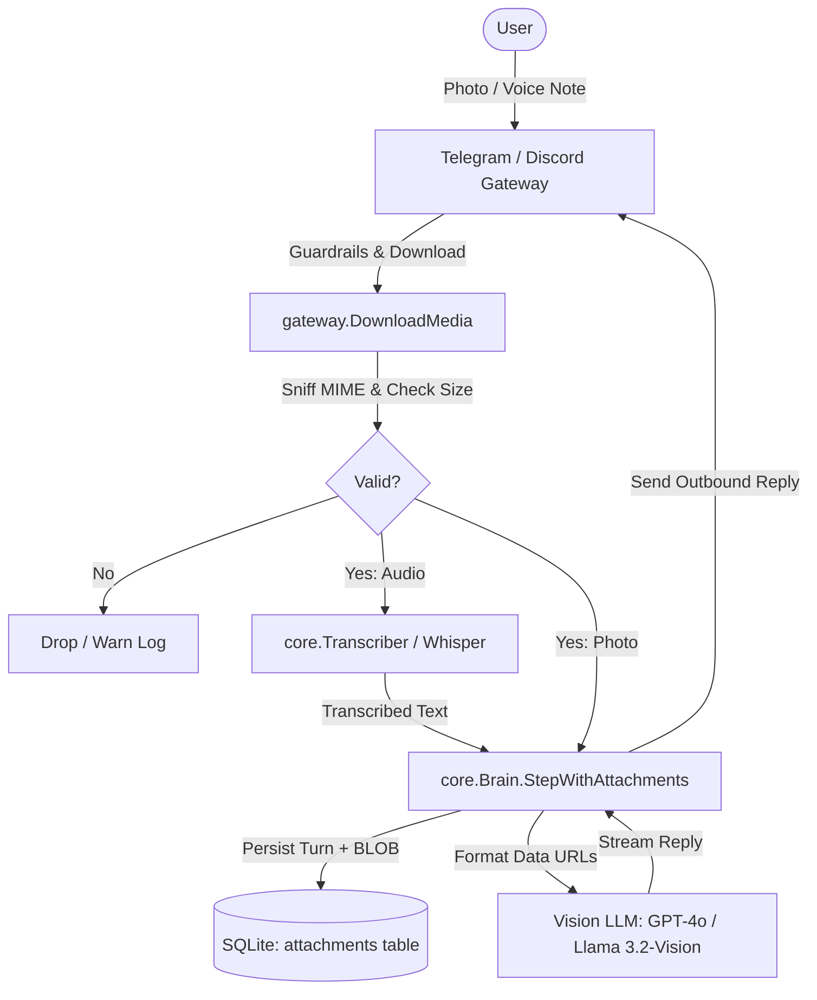

# Multimodal Ingestion (Vision & Audio)

AGIS supports native multimodal ingestion for vision (image analysis) and audio (speech-to-text transcription) across interactive chat, Telegram, and Discord gateways.

---

## Overview & Architecture

Multimodal capabilities are structured across three layers:
1. **Domain Model (`internal/core`)**:
   - `core.Attachment`: Universal media payload struct (`Type`, `MimeType`, `Data []byte`, `URL`, `Name`).
   - `core.Message.Attachments`: Embeds attachments directly on messages.
   - `core.Transcriber`: Decoupled port for audio speech-to-text transcription.
2. **Adapters & Providers (`internal/adapters/llm`)**:
   - **Vision Multipart Formatter**: Transforms messages with image attachments into OpenAI/Ollama-compatible content arrays (`{"type": "text", ...}`, `{"type": "image_url", "image_url": {"url": "data:image/png;base64,..."}}`).
   - **OpenAI Whisper Adapter**: `Whisper` transcriber communicating with `/v1/audio/transcriptions` via `multipart/form-data`.
3. **Gateway Media Ingestion (`internal/gateway`)**:
   - Telegram & Discord media pipelines with timeout wrappers, `io.LimitReader` stream guards, and `http.DetectContentType` MIME sniffing.
   - Voice note transcription into message prompts prior to Brain turn dispatch.
4. **Persistence (`internal/memory`)**:
   - SQLite migration `0007_attachments.sql` persisting media attachments in the `attachments` table linked with foreign keys and cascade deletion.



---

## Configuration

Add the `multimodal` section to your `$AGIS_HOME/config.yaml`:

```yaml
multimodal:
  enabled: true

  vision:
    enabled: true
    model: "gpt-4o"            # or "llama3.2-vision", "gpt-4o-mini"
    max_image_size_mb: 10       # maximum image upload size in MB (default: 10)

  audio:
    enabled: true
    provider: "openai"         # transcription provider: "openai" (Whisper)
    model: "whisper-1"         # default model
    max_audio_size_mb: 25      # maximum audio upload size in MB (default: 25)
```

---

## Supported Formats & Guardrails

### Allowed Image Formats
- `image/png` (`.png`)
- `image/jpeg` (`.jpg`, `.jpeg`)
- `image/webp` (`.webp`)
- `image/gif` (`.gif`)

*Maximum Size Limit:* 10MB (default).

### Allowed Audio Formats
- `audio/ogg` (`.ogg`, `.oga`) - Telegram voice notes (Opus)
- `audio/wav` (`.wav`)
- `audio/mpeg` (`.mp3`)
- `audio/mp4` / `audio/x-m4a` (`.m4a`)
- `audio/aac` (`.aac`)

*Maximum Size Limit:* 25MB (default).

### Security Guardrails
- **Content-Length & Stream Size Guards**: Gateways check headers and enforce an `io.LimitReader` stream boundary, failing closed on oversized files.
- **MIME Sniffing**: The first 512 bytes are inspected with `http.DetectContentType` and custom magic byte detectors (e.g. `OggS`, `RIFF...WAVE`) to prevent spoofed extensions or malicious executables.
- **Fail-Closed Policy**: Unsupported media types are rejected immediately with security warning logs.

---

## Telegram Media Ingestion

When `gateway.telegram.enabled: true`:
- **Photos**: Telegram sends multiple photo sizes. AGIS selects the highest resolution, fetches the file path via `getFile`, downloads the image over HTTPS, and embeds it as a vision attachment.
- **Voice Notes & Audio**: Downloaded and passed to `core.Transcriber` (Whisper). The transcription text becomes the message input to the Brain while the raw audio bytes are stored as an attachment.

---

## Discord Media Ingestion

When `gateway.discord.enabled: true`:
- **Attachments**: AGIS inspects inbound message attachments.
- Images matching allowed image MIME types are downloaded from Discord's CDN and passed to the vision pipeline.
- Audio files (e.g. `.ogg`, `.wav`, `.mp3`) are downloaded and transcribed into text prompts.

---

## SQLite Attachments Schema (`0007_attachments.sql`)

```sql
CREATE TABLE IF NOT EXISTS attachments (
    id         TEXT PRIMARY KEY,
    message_id TEXT NOT NULL,
    type       TEXT NOT NULL,
    mime_type  TEXT NOT NULL,
    data       BLOB,
    url        TEXT NOT NULL DEFAULT '',
    name       TEXT NOT NULL DEFAULT '',
    created_at TEXT NOT NULL,
    FOREIGN KEY(message_id) REFERENCES messages(id) ON DELETE CASCADE
);

CREATE INDEX IF NOT EXISTS idx_attachments_msg ON attachments(message_id);
PRAGMA user_version = 7;
```
