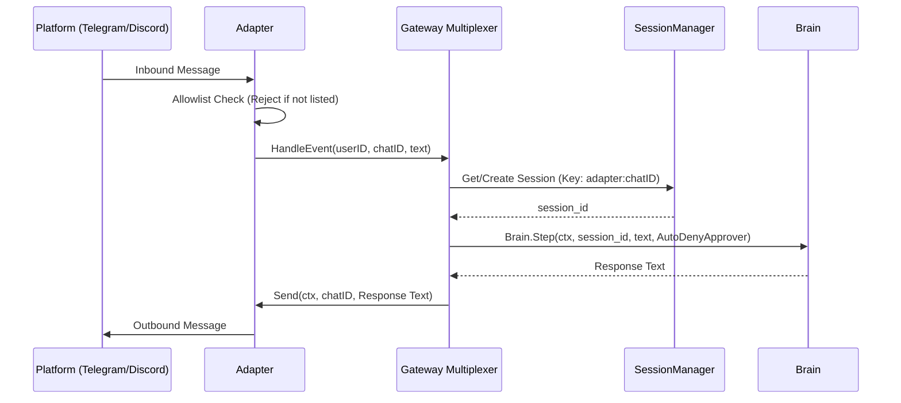
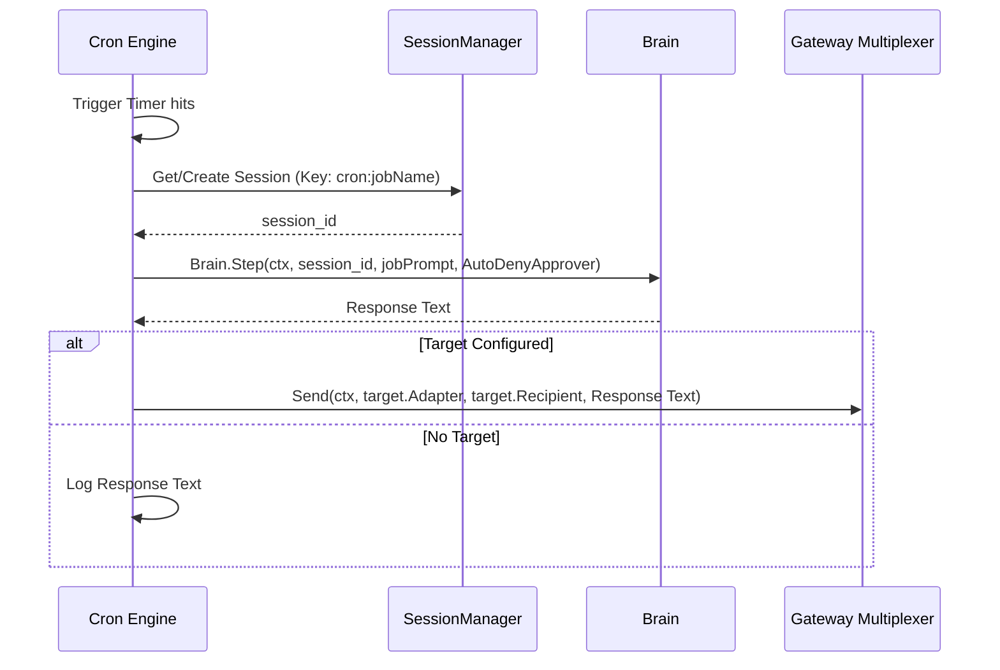
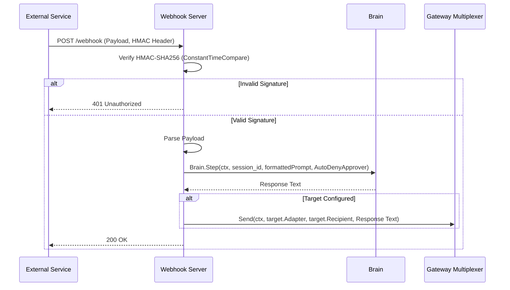

# Technical Design: M6 Ecosystem

This document outlines the technical architecture for the `m6-ecosystem` change, expanding AGIS into a multi-interface, event-driven agent with Gateway (Telegram/Discord), Cron, Plugins, and Webhooks.

## Architecture Decisions (ADRs)

| ADR | Decision |
|---|---|
| **D1: Gateway Multiplexer** | Provide `gateway.Multiplexer` to orchestrate multiple `gateway.Adapter` implementations. Adapters handle protocol-specific connections (Telegram, Discord) and delegate normalized events to the multiplexer for unified session mapping and brain execution. |
| **D2: Non-Interactive Approver** | Introduce a non-interactive `policy.Approver` for background processes (Gateway, Cron, Webhook). This automatically denies any `DecisionAsk` under the `sandbox` tier, ensuring background tasks never deadlock waiting for human input. |
| **D3: Concurrency & Lifecycle** | Rely on `context.Context` for cancellation and `sync.WaitGroup` / `errgroup.Group` for graceful shutdown. All long-running processes (`Start(ctx)`) will block until the context is canceled, triggering `Stop()` on all components to drain inflight operations. |
| **D4: Cron Scheduling** | Implement `cron.Scheduler` around an engine to parse 5-field cron strings and intervals. Jobs will execute isolated or session-bound `Brain.Step` calls, forwarding outputs to a `target` gateway via the multiplexer. |
| **D5: Plugin Discovery** | `internal/plugins` will read `plugin.json` manifests. Discovered tools execute via a standard command bridge (entrypoint + JSON args). State (enabled/disabled) persists separately from the code. |
| **D6: Webhook Security** | Ingest events through a `net/http` endpoint. Requests must pass `crypto/subtle.ConstantTimeCompare` signature verification using `HMAC-SHA256` before payload parsing and Brain dispatch. |
| **D7: Config Extensions** | Add struct fields for gateway, cron, plugins, and webhooks in `internal/config/config.go`. All ecosystem features default to `enabled: false` to ensure zero-impact on existing installations. |
| **D8: Subcommand Wiring** | Add Cobra subcommands `gateway`, `cron`, `plugins`, and `webhook` to `cmd/agis/`. These serve as separate daemon entry points. |

## Data Structures & Interfaces

```go
// internal/gateway/adapter.go
package gateway

import "context"

type Adapter interface {
	Name() string
	Start(ctx context.Context) error
	Stop() error
	Send(ctx context.Context, target string, msg string) error
}

type Multiplexer interface {
	Start(ctx context.Context) error
	Stop() error
	Send(ctx context.Context, adapter string, target string, msg string) error
}
```

```go
// internal/cron/scheduler.go
package cron

import "context"

type Job struct {
	Name      string
	Schedule  string
	Prompt    string
	SessionID string
	Target    *Target
}

type Target struct {
	Adapter   string
	Recipient string
}

type Scheduler interface {
	Start(ctx context.Context) error
	Stop() error
	AddJob(job Job) error
}
```

```go
// internal/plugins/manager.go
package plugins

type Manifest struct {
	Name        string         `json:"name"`
	Version     string         `json:"version"`
	Description string         `json:"description,omitempty"`
	Entrypoint  string         `json:"entrypoint,omitempty"`
	Tools       []Tool         `json:"tools,omitempty"`
	Skills      []string       `json:"skills,omitempty"`
	Permissions []string       `json:"permissions,omitempty"`
}

type Tool struct {
	Name        string         `json:"name"`
	Description string         `json:"description"`
	Parameters  map[string]any `json:"parameters"`
}

type PluginInfo struct {
	Manifest Manifest
	Enabled  bool
}

type Manager interface {
	Load(dir string) error
	List() []PluginInfo
	Enable(name string) error
	Disable(name string) error
}
```

```go
// internal/webhook/server.go
package webhook

import "context"

type Server interface {
	Start(ctx context.Context) error
	Stop() error
}
```

## Sequence Diagrams

### 1. Inbound Message Routing


### 2. Cron Scheduled Execution


### 3. Webhook HTTP POST


## Files Changed

| Path | Responsibility |
|---|---|
| `internal/config/config.go` | (Modified) Extend with `Gateway`, `Cron`, `Plugins`, `Webhook` fields with safe zero-value defaults. |
| `internal/gateway/adapter.go` | (New) `Adapter` interface and allowlist validation logic. |
| `internal/gateway/multiplexer.go` | (New) `Multiplexer` implementation and brain dispatch logic. |
| `internal/gateway/telegram.go` | (New) Telegram bot API client and chunking. |
| `internal/gateway/discord.go` | (New) Discord gateway client and splitting. |
| `internal/gateway/approver.go` | (New) Non-interactive `AutoDenyApprover` implementation. |
| `internal/cron/scheduler.go` | (New) Cron `Scheduler` interface and `Job` structs. |
| `internal/cron/engine.go` | (New) Background cron loop and execution dispatcher. |
| `internal/plugins/manager.go` | (New) `Manager` implementation and registry integration. |
| `internal/plugins/manifest.go` | (New) `Manifest` struct definitions and validation. |
| `internal/webhook/server.go` | (New) `Server` interface, `net/http` endpoint, and HMAC verification. |
| `cmd/agis/gateway.go` | (New) Cobra subcommand `agis gateway run`. |
| `cmd/agis/cron.go` | (New) Cobra subcommands `agis cron [run|list]`. |
| `cmd/agis/plugins.go` | (New) Cobra subcommands `agis plugins [list|enable|disable|inspect]`. |
| `cmd/agis/webhook.go` | (New) Cobra subcommand `agis webhook run`. |