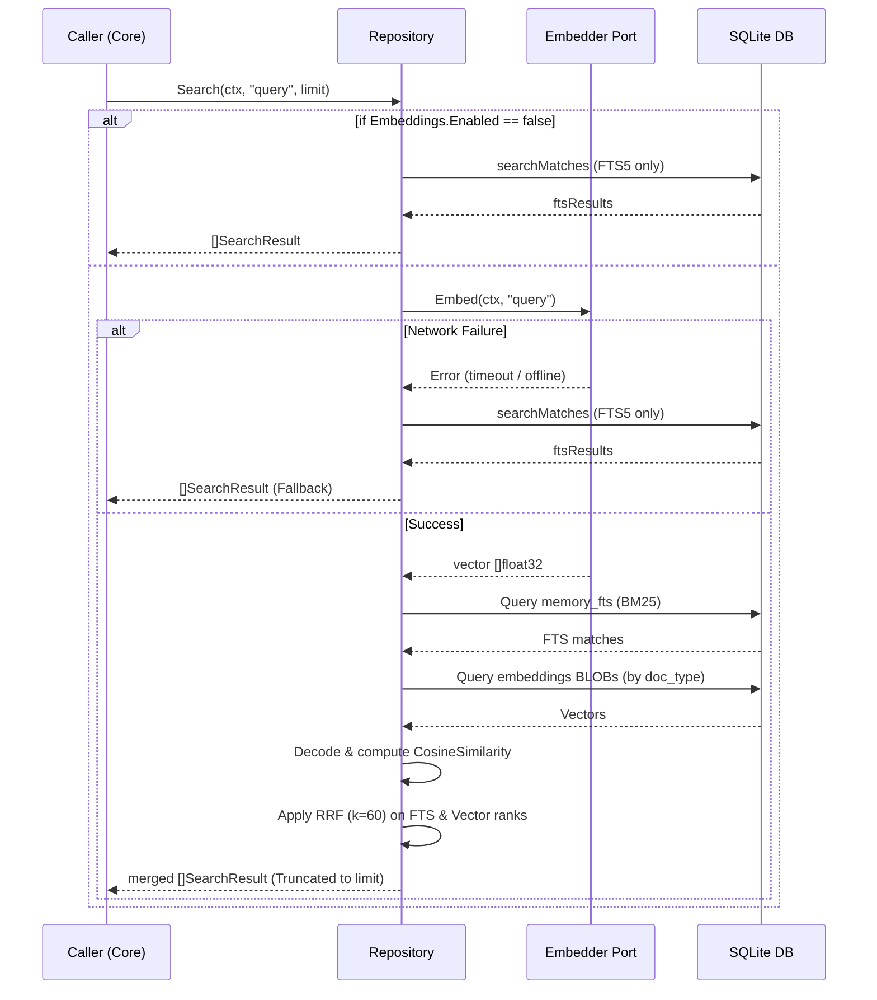
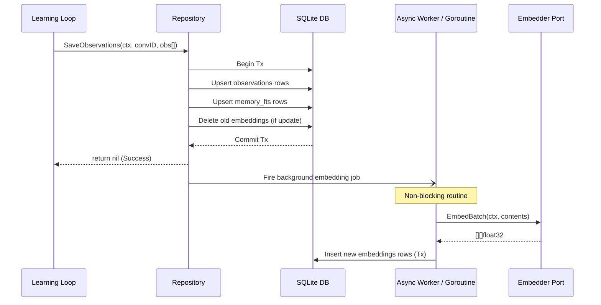

# Technical Design: M7 - Hybrid Search

## 1. Architecture Decisions (ADRs)

*   **D1: Embedder Port and Adapters**: We introduce a new domain port `core.Embedder` inside `internal/core/port_embedder.go`. This decouples the embedding generation logic from the database, allowing us to build interchangeable adapters for `ollama` and `openai` (inside `internal/adapters/llm/`).
*   **D2: Pure Go Binary BLOB Encoding**: To minimize dependency footprint and maintain broad compatibility without relying on SQLite C extensions like `sqlite-vss`, we encode standard IEEE 754 32-bit floating point vectors natively. We use `encoding/binary.LittleEndian` combined with `math.Float32bits`/`math.Float32frombits` to serialize `[]float32` arrays into `[]byte` BLOBs and store them directly in the `embeddings` table.
*   **D3: In-Memory Cosine Similarity**: Search relies on pure Go cosine similarity computation. Upon execution, candidate vectors are loaded into memory, and similarity is computed iterating over elements. This is sufficiently performant given typical long-term memory constraints (10^3 to 10^5 vectors).
*   **D4: Reciprocal Rank Fusion (RRF)**: Combining keyword and semantic results presents a scaling problem, as BM25 scores (unbounded) do not map linearly to Cosine Similarity scores ([-1, 1]). RRF solves this by ranking result sets independently and computing $Score = \sum \frac{1}{60 + rank}$.
*   **D5: Normalization via `0006_embeddings.sql`**: The embeddings are partitioned in a dedicated associative table `embeddings` mapped to `(doc_type, doc_id)`. This keeps `observations` and `messages` clean while allowing index-only drops/rebuilds.
*   **D6: Resiliency & Graceful Fallback**: Network requests for embeddings are failure-prone. Search requests MUST NOT bubble up network errors. If an embedding provider is unreachable or times out, the repository immediately falls back to resolving results using strictly FTS5 keyword matches, logging the degradation as a warning.
*   **D7: Asynchronous Embedding Pipeline**: Emitting observations is a synchronous transaction that blocks the LLM feedback loop. A background goroutine/worker queue will be spawned from `SaveObservations` to handle the actual LLM `Embed` calls, decoupling persistence latency from embedding latency.
*   **D8: Configuration Extensions**: `internal/config/config.go` integrates an opt-in `EmbeddingsConfig` struct block under `Config`, ensuring hybrid search remains disabled by default for reverse compatibility unless explicitly toggled by users.

## 2. Data Structures & Interfaces

### Core Interfaces
```go
// internal/core/port_embedder.go
package core

import "context"

type Embedder interface {
	Embed(ctx context.Context, text string) ([]float32, error)
	EmbedBatch(ctx context.Context, texts []string) ([][]float32, error)
	Dimension() int
}
```

### Config Schema
```go
// internal/config/config.go (Modifications)
type EmbeddingsConfig struct {
	Enabled    bool   `yaml:"enabled"`
	Provider   string `yaml:"provider"`
	Model      string `yaml:"model"`
	Dimensions int    `yaml:"dimensions"`
	BatchSize  int    `yaml:"batch_size"`
}
// added to Config struct: Embeddings EmbeddingsConfig `yaml:"embeddings"`
```

### Vector Helpers (internal/memory/vector.go)
```go
// Encodes a float32 vector into a byte slice.
func EncodeVector(v []float32) []byte

// Decodes a byte slice into a float32 vector, erroring on bad lengths.
func DecodeVector(b []byte) ([]float32, error)

// Computes pure Go cosine similarity between u and v.
func CosineSimilarity(u, v []float32) float32
```

### Reciprocal Rank Fusion
```go
// Evaluates hybrid results internally within the Repository.
// Formula: sum(1 / (k + rank)) for each rank list, where k = 60.
```

### SQLite Schema (`0006_embeddings.sql`)
```sql
CREATE TABLE IF NOT EXISTS embeddings (
    id         TEXT PRIMARY KEY,
    doc_type   TEXT NOT NULL,
    doc_id     TEXT NOT NULL,
    dimension  INTEGER NOT NULL,
    vector     BLOB NOT NULL,
    created_at TEXT NOT NULL,
    updated_at TEXT NOT NULL,
    UNIQUE(doc_type, doc_id)
);

CREATE INDEX IF NOT EXISTS idx_embeddings_doc ON embeddings(doc_type, doc_id);
PRAGMA user_version = 6;
```

## 3. Sequence Diagrams

### Diagram 1: Hybrid Search Query Execution Flow


### Diagram 2: Observation Persistence Flow


## 4. File Map & Responsibilities

| File Path | Type | Responsibility |
|---|---|---|
| `internal/core/port_embedder.go` | New | Declares the `Embedder` interface and contract behaviors. |
| `internal/adapters/llm/ollama_embed.go` | New | Implements `core.Embedder` for Ollama HTTP `/api/embed`. |
| `internal/adapters/llm/openai_embed.go` | New | Implements `core.Embedder` for OpenAI `/v1/embeddings` w/ chunking. |
| `internal/memory/vector.go` | New | Contains binary math tools: `EncodeVector`, `DecodeVector`, `CosineSimilarity`. |
| `internal/memory/search.go` (or `fts.go` modification) | Modified | Adapts `Search()` to query vectors, coordinate RRF merging, and handle graceful fallback. |
| `internal/memory/sqlite.go` | Modified | Updates `SaveObservations` to delete old embeddings on upsert and dispatch background embedding jobs via the adapter. |
| `internal/memory/migrations/0006_embeddings.sql` | New | DDL schema additions for storing the raw BLOB payloads. |
| `internal/config/config.go` | Modified | Overlays `EmbeddingsConfig` onto the root `Config` with backwards-compatible fallbacks. |
