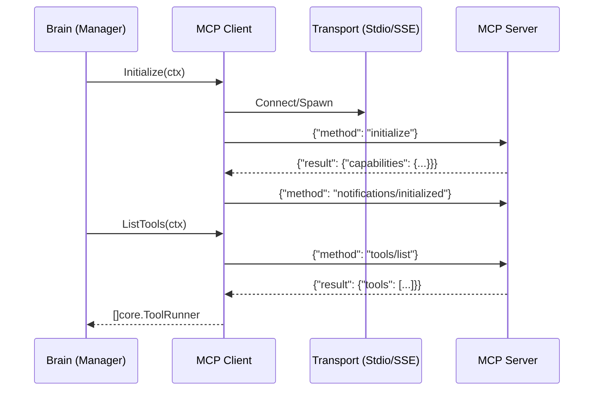
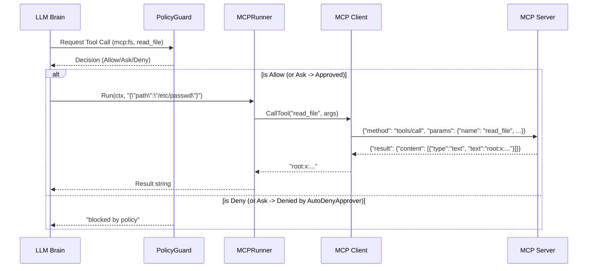

# Technical Design: m8-mcp-client

## 1. Architecture Decisions (ADRs)

### D1: JSON-RPC 2.0 Protocol & Multiplexing
- **Decision**: Implement a pure Go JSON-RPC 2.0 client (`internal/mcp/protocol.go`, `client.go`) without external runtime dependencies.
- **Details**:
  - The client maintains a `map[string]chan *JSONRPCResponse` protected by a `sync.Mutex` to correlate responses to pending requests using the `id` field.
  - A background `receiveLoop` goroutine reads from the `Transport`, decodes messages, and routes them to the correct channel or handles notifications.
  - Context cancellation on `CallTool` aborts the request, deletes the tracking ID, and returns `context.DeadlineExceeded`.

### D2: Process Supervision for Stdio Transport
- **Decision**: Use `os/exec.CommandContext` in `internal/mcp/transport/stdio.go` with process group isolation.
- **Details**:
  - `SysProcAttr` with `Setpgid: true` (on POSIX) ensures child processes of the server don't leak.
  - `WaitDelay = 100ms` ensures graceful shutdown before `SIGKILL`.
  - JSON-RPC messages are read line-by-line via `bufio.Scanner` from `stdout`.
  - `stderr` is continuously consumed in a separate goroutine and routed to `slog`, preventing blocking and parser corruption.

### D3: Remote SSE Network Transport
- **Decision**: Implement `internal/mcp/transport/sse.go` using `net/http`.
- **Details**:
  - Connects via `GET` with `Accept: text/event-stream`. Uses `bufio.Reader` to parse SSE events (`event: endpoint`, `data: ...`).
  - Upon receiving the `endpoint` event, records the POST URI.
  - `Send` method issues an HTTP `POST` to the session URI.
  - `Receive` yields messages from SSE `message` events.

### D4: Dynamic MCP Tool Discovery
- **Decision**: Clients will query `tools/list` on `Initialize` and convert results to internal models.
- **Details**:
  - Paginates via `nextCursor` until all tools are retrieved.
  - Maps MCP JSON schemas into AGIS `core.ToolDef`.
  - The `mcp.Manager` aggregates tools from all configured servers.

### D5: `core.ToolRunner` Adapter & PolicyGuard
- **Decision**: Extend `core.ToolRunner` and bridge MCP tools via `internal/tools/mcp.go`.
- **Details**:
  - `core.ToolRunner` interface is refactored to include `Name() string` and `Description() string`, replacing static name derivation in `toolDefs`.
  - The `MCPRunner` adapter sets `Backend() = "mcp:<server>"`.
  - `Brain.executeTool` formulates `GuardRequest{Backend: "mcp:<server>", Category: "commands", Subject: toolName}` and evaluates it via `PolicyGuard`.
  - Unapproved tools hit `DecisionAsk`. Background daemons using `AutoDenyApprover` will yield `ScopeDeny` (fail closed).

### D6: Multi-server Manager (`mcp.Manager`)
- **Decision**: Create an `mcp.Manager` to handle lifecycle and aggregation of multiple server configurations.
- **Details**:
  - Reads `cfg.MCP.Servers`.
  - `Start(ctx)` launches transports and clients concurrently.
  - `ListAllTools()` aggregates runners across all active servers.
  - Provides a single point of integration for `internal/tools/registry.go` to extract MCP `ToolRunner`s.

### D7: Configuration Extensions
- **Decision**: Add `MCPConfig` to `internal/config/config.go`.
- **Details**:
  - `MCP` field at the root level.
  - `Servers` map allows defining `stdio` (command/args) or `sse` (url) servers.

### D8: CLI Subcommands
- **Decision**: Add `cmd/agis/mcp.go` using the existing CLI framework.
- **Details**:
  - `agis mcp list`: Initializes the `mcp.Manager`, prints a formatted table of servers and tools.
  - `agis mcp test <server> <tool> [args]`: Instantiates a client, calls `tools/call`, and dumps the result, bypassing the LLM.

## 2. Data Structures & Interfaces

```go
// internal/mcp/transport/transport.go
type Transport interface {
	Send(ctx context.Context, msg []byte) error
	Receive(ctx context.Context) ([]byte, error)
	Close() error
}

// internal/mcp/client.go
type Client interface {
	Initialize(ctx context.Context) error
	ListTools(ctx context.Context) ([]Tool, error)
	CallTool(ctx context.Context, name string, args any) (string, error)
	Close() error
}

// internal/mcp/manager.go
type Manager interface {
	Start(ctx context.Context) error
	Stop() error
	Servers() map[string]Client
	ListAllTools() []core.ToolRunner
}

// internal/mcp/protocol.go
type JSONRPCRequest struct {
	JSONRPC string `json:"jsonrpc"`
	ID      string `json:"id,omitempty"`
	Method  string `json:"method"`
	Params  any    `json:"params,omitempty"`
}

type JSONRPCResponse struct {
	JSONRPC string        `json:"jsonrpc"`
	ID      string        `json:"id"`
	Result  any           `json:"result,omitempty"`
	Error   *JSONRPCError `json:"error,omitempty"`
}
```

## 3. Sequence Diagrams

### Diagram 1: Server Initialization & Discovery


### Diagram 2: Tool Calling & Policy Guard


## 4. File Map

**New Files:**
- `internal/mcp/protocol.go`: JSON-RPC structs and parsing.
- `internal/mcp/client.go`: Core MCP protocol logic and correlation.
- `internal/mcp/manager.go`: Multi-server coordination.
- `internal/mcp/transport/transport.go`: Transport interface.
- `internal/mcp/transport/stdio.go`: Local process lifecycle & streams.
- `internal/mcp/transport/sse.go`: HTTP network endpoints.
- `internal/tools/mcp.go`: `MCPRunner` bridging `core.ToolRunner`.
- `cmd/agis/mcp.go`: CLI subcommands for inspection.

**Modified Files:**
- `internal/config/config.go`: Add `MCPConfig` and `MCPServerConfig` types.
- `internal/core/port_learning.go`: Add `Name()` and `Description()` to `ToolRunner`.
- `internal/tools/local.go`, `internal/tools/backends.go`: Update existing runners to implement `Name()` and `Description()`.
- `internal/core/brain.go`: Update `executeTool` to handle dynamic tool names instead of statically prefixed `shell-` logic.
- `internal/plugins/manager.go`: Update plugin tool runner for interface compliance.
- `internal/tools/registry.go`: Incorporate `mcp.Manager` into `Select()` to dynamically inject MCP runners.
