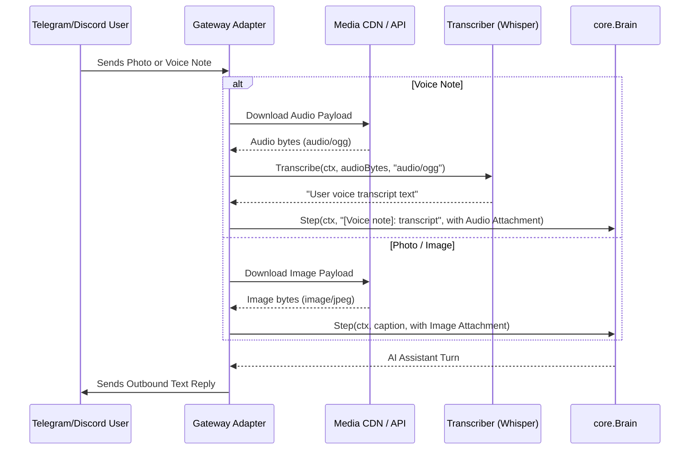
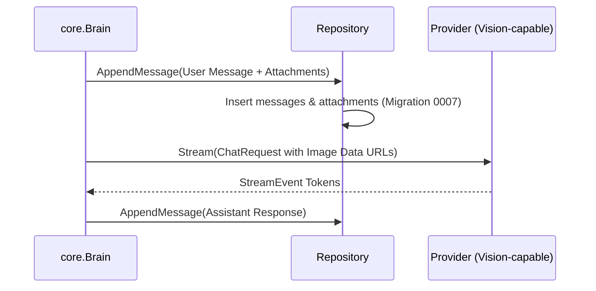

# Technical Design: M9 — Multimodal Ingestion (Vision & Audio)

## 1. Architecture Decisions (ADRs)

### D1: Universal `Attachment` Domain Model
- **Decision**: Define a first-class `Attachment` struct in `internal/core/types.go` and embed `Attachments []Attachment` on `core.Message`.
- **Details**:
  - `Attachment` contains `Type` (`"image"` or `"audio"`), `MimeType` (e.g. `"image/png"`, `"image/jpeg"`, `"audio/ogg"`, `"audio/wav"`), `Data []byte`, `URL string`, and `Name string`.
  - `core.ChatRequest` propagates messages with attachments to LLM provider adapters.
  - Text-only messages keep `Attachments: nil`, ensuring 100% backward compatibility.

### D2: Vision Multipart Content Array Transformation
- **Decision**: Transform messages with image attachments into standard OpenAI-compatible multipart content schemas in `internal/adapters/llm/client.go`.
- **Details**:
  - If a message has image attachments, its content is serialized as `[{"type": "text", "text": "..."}, {"type": "image_url", "image_url": {"url": "data:<mime>;base64,<encoded>"}}]`.
  - Supported vision MIME types: `image/png`, `image/jpeg`, `image/webp`, `image/gif`.
  - Works out of the box with OpenAI (GPT-4o, GPT-4o-mini), Ollama (Llama 3.2-Vision, Moondream), and OpenRouter.

### D3: `core.Transcriber` Domain Port
- **Decision**: Introduce a dedicated transcription interface in `internal/core/port_transcriber.go`:
  ```go
  type Transcriber interface {
      Transcribe(ctx context.Context, audio []byte, mimeType string) (string, error)
  }
  ```
- **Details**:
  - Decouples voice/audio speech-to-text processing from conversational brain logic and chat gateways.
  - Returns raw transcript string or descriptive error on empty payload / deadline expiry.

### D4: OpenAI Whisper Audio Transcription Adapter
- **Decision**: Implement `internal/adapters/llm/whisper.go` conforming to `core.Transcriber`.
- **Details**:
  - Issues `multipart/form-data` HTTP POST to `/v1/audio/transcriptions`.
  - Form fields: `file` (with appropriate filename e.g. `audio.ogg`), `model: "whisper-1"`.
  - Authenticates with `Authorization: Bearer <api_key>`.

### D5: Telegram Media Ingestion Pipeline
- **Decision**: Extend `internal/gateway/telegram.go` to handle photo and voice/audio messages.
- **Details**:
  - **Photos**: Inspects `photo` array in updates, selects the largest available resolution, calls `getFile` endpoint to resolve `file_path`, and downloads binary bytes.
  - **Voice Notes**: Inspects `voice` or `audio` objects, resolves `file_path` via `getFile`, downloads OGG/Opus bytes, and invokes `core.Transcriber` to produce text transcripts.
  - Appends downloaded media to `MessageEvent.Attachments`.

### D6: Discord Media Ingestion Pipeline
- **Decision**: Extend `internal/gateway/discord.go` to handle message attachments.
- **Details**:
  - Inspects `message.attachments` array for `image/*` or `audio/*` content types.
  - Downloads binary payload from Discord CDN URL with timeout.
  - If audio: transcribes to text via `core.Transcriber`.
  - Appends media to `MessageEvent.Attachments`.

### D7: Media Security & Size Guardrails
- **Decision**: Enforce strict size limits and MIME sniffing before processing.
- **Details**:
  - Max image size: 10MB (`10 * 1024 * 1024` bytes). Max audio size: 25MB.
  - Sniffs first 512 bytes with `http.DetectContentType` to verify genuine MIME header against allowed whitelist.
  - Downloads enforce a strict timeout (30s) to prevent resource exhaustion attacks.

### D8: Database Storage & Migration `0007_attachments.sql`
- **Decision**: Add an `attachments` table linked to `messages` via foreign key `message_id`.
- **Details**:
  - Schema:
    ```sql
    CREATE TABLE IF NOT EXISTS attachments (
        id         TEXT PRIMARY KEY,
        message_id TEXT NOT NULL,
        type       TEXT NOT NULL,
        mime_type  TEXT NOT NULL,
        data       BLOB,
        url        TEXT NOT NULL DEFAULT '',
        name       TEXT NOT NULL DEFAULT '',
        created_at TEXT NOT NULL,
        FOREIGN KEY(message_id) REFERENCES messages(id) ON DELETE CASCADE
    );
    CREATE INDEX IF NOT EXISTS idx_attachments_msg ON attachments(message_id);
    PRAGMA user_version = 7;
    ```

---

## 2. Sequence Diagrams

### Diagram 1: Inbound Media Ingestion & Voice Transcription in Gateway


### Diagram 2: Multimodal Brain Step & Vision Provider Execution


---

## 3. File Map & Package Layout

| Package | Path | Responsibility |
|---|---|---|
| `internal/core` | `internal/core/types.go` | (Modified) `Attachment` struct & `Message.Attachments` |
| `internal/core` | `internal/core/port_transcriber.go` | (New) `Transcriber` port interface |
| `internal/adapters/llm` | `internal/adapters/llm/client.go` | (Modified) Vision multipart payload formatting with Base64 Data URLs |
| `internal/adapters/llm` | `internal/adapters/llm/whisper.go` | (New) Whisper audio transcription adapter (`/v1/audio/transcriptions`) |
| `internal/gateway` | `internal/gateway/telegram.go` | (Modified) Photo and voice message downloaders & transcription |
| `internal/gateway` | `internal/gateway/discord.go` | (Modified) CDN attachment downloaders & transcription |
| `internal/memory` | `internal/memory/migrations/0007_attachments.sql` | (New) `attachments` table DDL & `user_version = 7` |
| `internal/memory` | `internal/memory/sqlite.go` | (Modified) Save and load attachments for messages |
| `internal/config` | `internal/config/config.go` | (Modified) `MultimodalConfig`, `VisionConfig`, `AudioConfig` |
| `cmd/agis` | `cmd/agis/main.go` | (Modified) Wire `Transcriber` and vision options |
