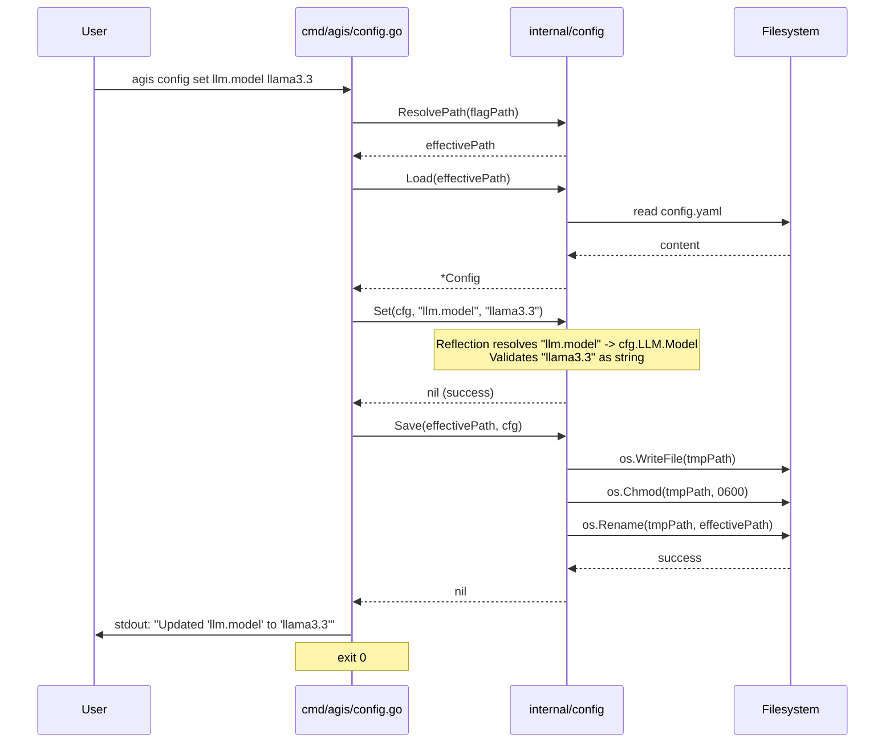

# Design: Config CLI Subcommands

## 1. Architecture Decision Records (ADRs)

*   **D1: CLI Command Router pattern with stdlib `flag.FlagSet`**
    We will implement a `RunConfigCLI` entrypoint in `cmd/agis/config.go` following the existing project pattern (as seen in `main.go`). It will initialize a `flag.FlagSet` for subcommands (`show`, `get`, `set`, `path`), parse arguments, and delegate execution to command-specific handlers. We intentionally avoid heavy frameworks like Cobra/Viper to keep binaries small, compilation fast, and maintain consistency with AGIS's existing architecture.
*   **D2: Dot-notation reflection/registry accessor & mutator (`Get`, `Set`)**
    `internal/config/accessor.go` will implement `Get(cfg *Config, key string) (any, error)` and `Set(cfg *Config, key string, valStr string) error`. It will traverse the `Config` struct using reflection (or a robust mapping registry) to map case-insensitive dot-notated keys (e.g., `llm.api_key` -> `cfg.LLM.APIKey`). This allows reading and updating values without hardcoding every single field, scaling automatically as the configuration expands.
*   **D3: Sensitive field masking engine (`MaskSecrets`)**
    To prevent credentials from leaking into terminal history or standard output, we will implement `MaskSecrets(cfg *Config) *Config`. It will deep-copy/shallow-clone the configuration and overwrite fields like `LLM.APIKey`, `Gateway.Telegram.Token`, `Gateway.Discord.Token`, and `Webhook.Secret` with `"[MASKED]"`. By default, `show` and `get` operations run on the masked clone unless a `--reveal` flag is explicitly provided.
*   **D4: Atomic file writing and permissions preservation (`Save` with 0600 mode)**
    `internal/config/save.go` will expose `Save(path string, cfg *Config) error`. The file writing MUST be atomic to prevent data corruption during mid-flight power failures. It will marshal the YAML to a temporary file (e.g., `config.yaml.tmp.<pid>`), forcefully set its permissions via `os.Chmod` to `0600` (`-rw-------`), sync the file descriptor, and atomically `os.Rename` it over the destination path. If the parent directory is missing, it will be created with `0700`.
*   **D5: Strict type validation**
    During a `Set` operation, the engine must validate the incoming string payload against the destination struct field type. Using packages like `strconv` and `time`, it will parse `bool`, `int`, `time.Duration`, `string`, and `[]string` (supporting comma-separated values or JSON arrays). Invalid values will cleanly abort the operation without touching the configuration.
*   **D6: Stream separation and POSIX exit codes (0, 1, 2)**
    The CLI will enforce strict stream discipline. Standard operational output (YAML/JSON configurations, retrieved values, confirmation messages) will target `stdout` for safe shell piping. Usage instructions, error messages, and diagnostics will target `stderr`. Exit codes will faithfully track POSIX conventions: `0` for success, `1` for domain errors (missing key, invalid type, file I/O failure), and `2` for flag or CLI usage errors.

## 2. Component Structure

```text
agis/
├── cmd/agis/
│   ├── config.go            # Entrypoint RunConfigCLI, flag routing, command handlers
│   └── config_test.go       # Tests for CLI routing, exit codes, and stdout/stderr stream checks
└── internal/config/
    ├── accessor.go          # Get, Set, MaskSecrets, ResolvePath definitions
    ├── accessor_test.go     # Tests for dot-notation reflection and type validation
    ├── save.go              # Atomic Save implementation (0600 enforcement)
    └── save_test.go         # Tests for file I/O and atomicity guarantees
```

## 3. Sequence Diagram



## 4. API and Type Signatures

**`cmd/agis/config.go`**
```go
// RunConfigCLI parses flags and routes execution to the appropriate config subcommand.
func RunConfigCLI(args []string, stdout, stderr io.Writer) int
```

**`internal/config/accessor.go`**
```go
// Get retrieves a configuration value using case-insensitive dot notation.
func Get(cfg *Config, key string) (any, error)

// Set validates and applies a string value to a configuration field via dot notation.
func Set(cfg *Config, key string, valStr string) error

// MaskSecrets returns a cloned Config where sensitive credentials are obfuscated.
func MaskSecrets(cfg *Config) *Config

// ResolvePath determines the active configuration file path.
func ResolvePath(flagPath string) string
```

**`internal/config/save.go`**
```go
// Save atomically writes the Config to the specified path with 0600 permissions.
func Save(path string, cfg *Config) error
```

## 5. Strict TDD Testing Strategy

Since Strict TDD Mode is active, all work must start with tests defining expectations prior to implementation:

1.  **`internal/config` Core Tests**:
    *   `TestGet`: Table-driven tests validating resolution of nested struct fields (e.g., `llm.api_key`, `LLM.Model`, `webhook.port`) and failing gracefully on non-existent keys.
    *   `TestSet`: Table-driven tests supplying various string arguments. Must assert successful parsing of types: `bool` (`"true"`, `"false"`), `int` (`"8080"`), `time.Duration` (`"30s"`), and `string`. Must fail identically on invalid strings (`"abc"` for `int`).
    *   `TestSave`: Using `t.TempDir()`, verify that `Save` creates necessary directories with `0700`, drops files atomically via rename, and validates file mode explicitly reads `0600`.
    *   `TestMaskSecrets`: Verify `cfg.LLM.APIKey` and other specified fields are strictly `" [MASKED] "` in the returned struct, ensuring the original struct is unmutated.

2.  **`cmd/agis` CLI Tests**:
    *   `TestRunConfigCLI`: Using `bytes.Buffer` for stdout/stderr, execute commands like `["show"]`, `["get", "llm.provider"]`, `["set", "webhook.port", "8080"]`, and `["path"]`.
    *   Assert standard operational output is exclusively captured in the `stdout` buffer.
    *   Assert error messages and usage text are exclusively captured in the `stderr` buffer.
    *   Assert exit codes align strictly with POSIX rules (0 for success, 1 for logical errors, 2 for syntax arguments).
