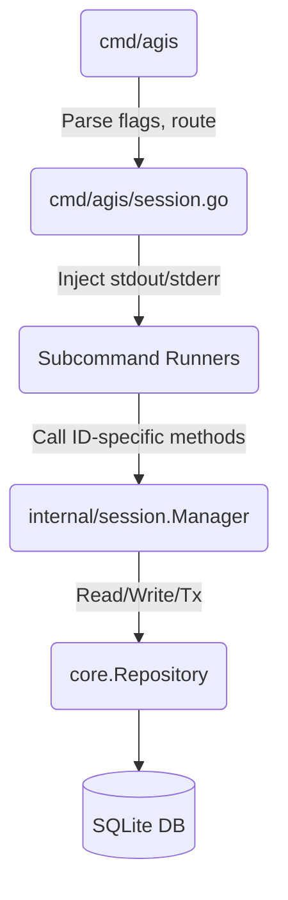
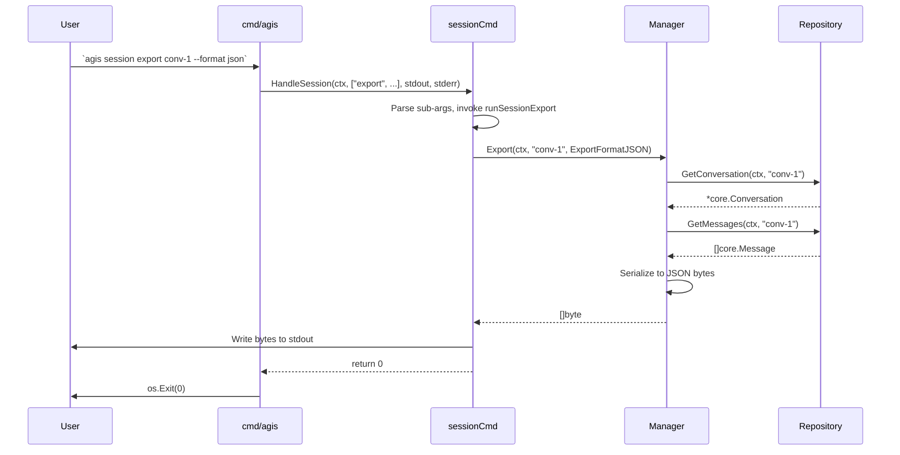

# Architecture and Design: session-cli

## 1. Executive Summary
This design implements a headless CLI interface to manage AGIS conversation sessions, enabling scripting, data portability, and automated maintenance without requiring the interactive Bubbletea TUI. It builds upon a lightweight standard library `flag.FlagSet` subcommand router and introduces stateless, targetable operations to the `internal/session.Manager`.

## 2. Architecture Decision Records (ADRs)

### D1: CLI Command Router pattern in `cmd/agis/session.go` using stdlib `flag.FlagSet`
- **Context:** AGIS requires straightforward subcommands (`list`, `show`, `delete`, `rename`, `export`, `snapshot`) but avoids heavy dependencies like `cobra` to maintain binary size and compilation speed.
- **Decision:** Use a nested `flag.FlagSet` approach. A master router `HandleSession` will parse the first positional argument to dispatch execution to specific subcommand runners (e.g., `runSessionList`), each instantiating its own `flag.FlagSet` for isolated flags (`-json`, `-limit`, `-format`).
- **Tradeoffs:** Requires slightly more boilerplate for routing compared to Cobra, but remains dependency-free and follows existing project CLI patterns.
- **Testability:** Command runners accept `out` and `errOut` `io.Writer` parameters (defaulting to `os.Stdout`/`os.Stderr`), ensuring exact stream output captures during testing (per `golang-cli` best practices).

### D2: Stateless Session Manager extensions in `internal/session/manager.go`
- **Context:** `Manager` historically targets an `activeID` tracked via TUI state. CLI operations must manipulate arbitrary sessions without disrupting TUI state.
- **Decision:** Extend `Manager` with explicit ID-targeted methods (`Show`, `Delete`, `Export`, `SnapshotSession`).
  - `Delete` will inspect `m.activeID` and clear it (`m.activeID = ""`) only if it matches the deleted ID, preventing dangling references.
  - The existing `Snapshot(ctx)` will be refactored to delegate to `SnapshotSession(ctx, m.activeID)`.

### D3: Multi-format export serialization engine
- **Context:** The `export` command needs to serialize histories for automation (JSON), documentation (Markdown), and raw logging (Plaintext).
- **Decision:** Create an `ExportFormat` string enumeration. Export formats are generated via isolated builder functions. Markdown and Plaintext will leverage `strings.Builder` inside standard `range` loops over messages to maintain `O(N)` memory footprint and avoid excessive allocations (per `golang-code-style`). JSON will use standard `encoding/json` with struct tags (`omitempty`).

### D4: Cascade deletion semantics and SQLite schema interactions
- **Context:** Hard deletions must not leave orphaned messages, attachments, or snapshot metadata.
- **Decision:** The underlying `core.Repository.DeleteConversation` must ensure foreign key cascade constraints are respected. If `sqlite3` PRAGMA foreign_keys are conditionally enforced, the transaction within `DeleteConversation` will manually cascade (`DELETE FROM messages WHERE conversation_id = ?`, etc.) before deleting the root record, ensuring guaranteed semantic consistency.

### D5: Stdout/Stderr stream separation and POSIX exit code mapping
- **Context:** Automation relies on strict Unix pipe semantics.
- **Decision:**
  - Exit code `0`: Success.
  - Exit code `1`: Domain/runtime errors (Not Found, DB constraints).
  - Exit code `2`: Usage errors (Invalid flag, unrecognized subcommand).
  - Output streams: Programmatic data (JSON, exported text) goes exclusively to `stdout`. Diagnostics, prompts, and errors go exclusively to `stderr`. Command runners return `int` rather than calling `os.Exit()`, allowing `main()` to control process termination and `defer` executions gracefully.

## 3. Component and Sequence Diagrams

### Component Architecture


### Sequence Diagram: CLI Execution Flow (`export`)


## 4. Go API Signatures

```go
// internal/session/manager.go

type ExportFormat string

const (
    ExportFormatJSON     ExportFormat = "json"
    ExportFormatMarkdown ExportFormat = "markdown"
    ExportFormatTXT      ExportFormat = "txt"
)

// Targetable stateless extensions
func (m *Manager) Show(ctx context.Context, id string) (*core.Conversation, []core.Message, error)
func (m *Manager) Delete(ctx context.Context, id string) error
func (m *Manager) SnapshotSession(ctx context.Context, id string) (*core.Snapshot, error)
func (m *Manager) Export(ctx context.Context, id string, format ExportFormat) ([]byte, error)


// cmd/agis/session.go

// HandleSession is the main entrypoint for the 'session' root command.
func HandleSession(ctx context.Context, args []string, out, errOut io.Writer) int

// Subcommand internal handlers
func runSessionList(ctx context.Context, args []string, out, errOut io.Writer, mgr *session.Manager) int
func runSessionShow(ctx context.Context, args []string, out, errOut io.Writer, mgr *session.Manager) int
func runSessionDelete(ctx context.Context, args []string, out, errOut io.Writer, mgr *session.Manager) int
func runSessionRename(ctx context.Context, args []string, out, errOut io.Writer, mgr *session.Manager) int
func runSessionExport(ctx context.Context, args []string, out, errOut io.Writer, mgr *session.Manager) int
func runSessionSnapshot(ctx context.Context, args []string, out, errOut io.Writer, mgr *session.Manager) int
```

## 5. Strict TDD Testing Architecture

Given the project requires **Strict TDD Mode**:
1. **Unit Testing (`internal/session/manager_test.go`)**:
   - Table-driven tests covering `Show`, `Delete`, `Export`, and `SnapshotSession`.
   - Use in-memory mocks or a test-backed SQLite connection for `core.Repository`.
   - Validate that `Manager.Delete` correctly purges `Manager.activeID` *only* when they match.
   - Validate `Export` serialization for all three `ExportFormat` types using test fixtures for `[]core.Message`.
2. **Integration Testing (`cmd/agis/session_test.go`)**:
   - Tests will execute `HandleSession` explicitly providing `bytes.Buffer` arrays for `out` and `errOut` to assert isolation.
   - Verifies mapping logic of POSIX exit codes against `errors.Is(err, core.ErrNotFound)` and `flag.ErrHelp`.
   - Asserts `-yes` flag validation on `delete` acts correctly simulating non-interactive boundaries.
   - Asserts stream cleanliness (e.g., `-json` outputs must have 0 bytes of error/logging interleaved into `out` buffers).
