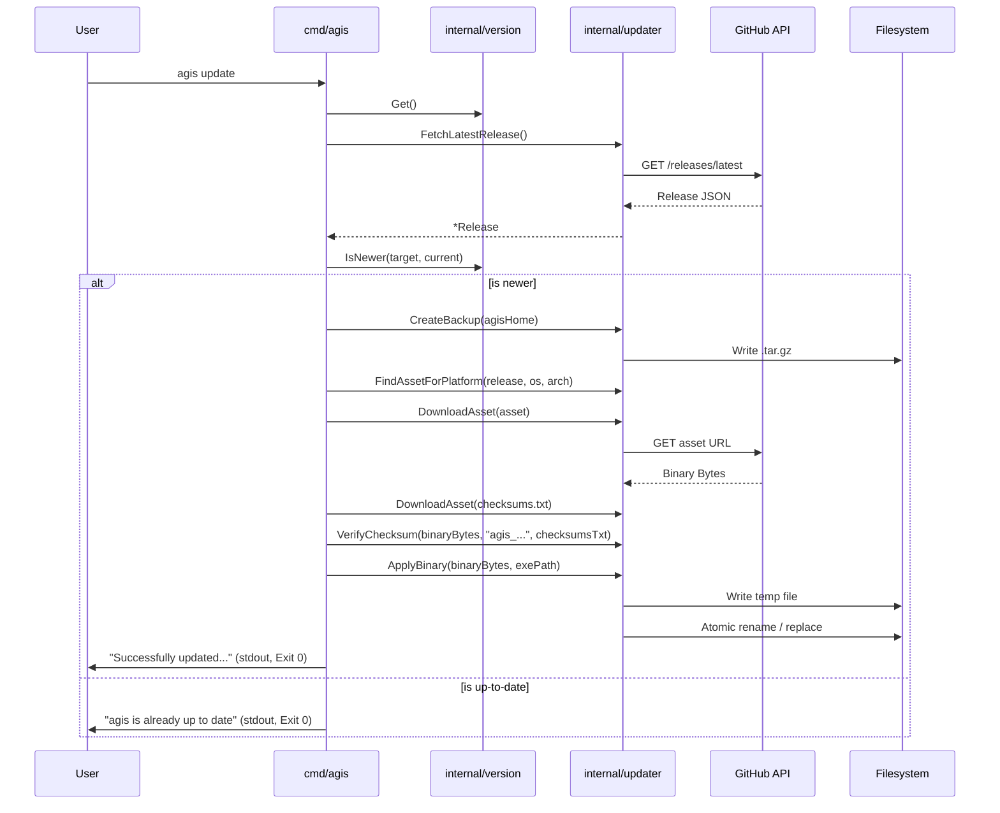

# Architecture & Design: update-cli

## 1. Architecture Decision Records (ADRs)

*   **D1: Centralized `internal/version` package**
    We will manage all version-related logic in `internal/version`. The build information (`Version`, `Commit`, `BuildDate`) will be injected at compile-time via `ldflags`. The package will provide strict Semantic Versioning (SemVer) utilities to handle `v` prefixes and gracefully manage the `"dev"` build edge case.
*   **D2: Modular `internal/updater` package**
    The core update mechanics will reside in `internal/updater`, partitioned logically by responsibility:
    *   `client.go`: Handles GitHub API interaction (HTTP requests, parsing JSON, fetching assets).
    *   `backup.go`: Encapsulates `$AGIS_HOME` state snapshotting.
    *   `apply.go`: Encapsulates the OS-specific file replacement.
    *   `verify.go`: Handles SHA-256 validation.
*   **D3: GoReleaser asset mapping for OS/Arch**
    The updater will match the running process architecture (`runtime.GOOS`, `runtime.GOARCH`) against standard GoReleaser naming conventions (e.g., `agis_linux_amd64.tar.gz`, `agis_windows_amd64.zip`, `agis_darwin_arm64.tar.gz`) to locate the correct platform asset dynamically.
*   **D4: Atomic in-place executable replacement across POSIX and Windows**
    Replacing a running binary requires OS-specific handling. On Unix (Linux/macOS), `os.Rename` safely replaces an executable file. On Windows, open executables are locked; we must rename the running binary to `.old` before moving the downloaded binary into place.
*   **D5: `$AGIS_HOME` state backup into `.tar.gz` with directory creation**
    The backup will blindly compress a predefined list of files/directories (`agis.db`, `config.yaml`, `policy.yaml`, `SOUL.md`, `skills/`, `plugins/`) into `$AGIS_HOME/backups/agis-backup-<timestamp>.tar.gz`. Missing optional files are skipped natively without failing the backup.
*   **D6: CLI entry point `RunUpdateCLI` with stream isolation**
    The UI will reside in `cmd/agis/update.go`. To ensure testability and strictly honor POSIX stream conventions, the logic will be encapsulated in `RunUpdateCLI(args []string, stdout, stderr io.Writer) int`. `stdout` is strictly for final parseable outcomes, and `stderr` for logs/progress.

## 2. Sequence Diagram



## 3. Interfaces and Structs

### 3.1. `internal/version`

```go
package version

var (
    // Injected via ldflags
    Version   = "dev"
    Commit    = "none"
    BuildDate = "unknown"
)

type Info struct {
    Version   string
    Commit    string
    BuildDate string
}

// Get returns the populated Info struct.
func Get() Info

// Compare returns -1 if v1 < v2, 0 if v1 == v2, 1 if v1 > v2.
// It strips "v" prefixes and parses valid semver.
func Compare(v1, v2 string) (int, error)

// IsNewer returns true if target is semantically newer than current.
// If current is "dev", it returns true for any valid target release.
func IsNewer(target, current string) bool
```

### 3.2. `internal/updater`

```go
package updater

import (
    "context"
    "net/http"
)

// GitHub API Structs
type Release struct {
    TagName     string  `json:"tag_name"`
    Name        string  `json:"name"`
    PublishedAt string  `json:"published_at"`
    HTMLURL     string  `json:"html_url"`
    Assets      []Asset `json:"assets"`
}

type Asset struct {
    Name               string `json:"name"`
    Size               int64  `json:"size"`
    BrowserDownloadURL string `json:"browser_download_url"`
}

// Client handles GitHub API interaction.
type Client struct {
    client  *http.Client
    baseURL string
}

// Option implements functional options for Client construction.
type Option func(*Client)

func WithHTTPClient(c *http.Client) Option
func WithBaseURL(url string) Option

func NewClient(repo string, opts ...Option) *Client

// FetchLatestRelease retrieves the latest release from the repository.
func (c *Client) FetchLatestRelease(ctx context.Context) (*Release, error)

// FetchReleaseByTag retrieves a specific release tag.
func (c *Client) FetchReleaseByTag(ctx context.Context, tag string) (*Release, error)

// FindAssetForPlatform finds the correct binary/archive and checksums for the OS/Arch.
func FindAssetForPlatform(release *Release, goos, goarch string) (*Asset, *Asset, error)

// DownloadAsset downloads the raw bytes for the given asset.
func (c *Client) DownloadAsset(ctx context.Context, asset *Asset) ([]byte, error)

// VerifyChecksum ensures the downloaded bytes match the hash found in checksumsText.
func VerifyChecksum(assetBytes []byte, assetName string, checksumsText []byte) error

// CreateBackup archives critical $AGIS_HOME files to a timestamped tar.gz in destDir.
func CreateBackup(agisHome string, destDir string) (string, error)

// ApplyBinary atomically writes the new binary and replaces targetPath.
func ApplyBinary(newBinaryData []byte, targetPath string) error
```

### 3.3. `cmd/agis` (CLI Wrapper)

```go
package cmd

import (
    "io"
    "github.com/spf13/cobra"
)

// NewUpdateCmd creates the Cobra command. 
// Uses cmd.OutOrStdout() and cmd.ErrOrStderr() to satisfy stream isolation.
func NewUpdateCmd() *cobra.Command

// RunUpdateCLI encapsulates the CLI orchestration to allow test injection.
func RunUpdateCLI(args []string, stdout, stderr io.Writer) int
```

## 4. Error Flow & Resilience (Design Patterns)
*   **Functional Options**: `updater.NewClient` accepts options. This supports testing by allowing an `httptest.Server` URL via `WithBaseURL`.
*   **Early Return / No `else`**: Operations in `RunUpdateCLI` will check errors and immediately write to `stderr` and return code `1` or `2`.
*   **Timeouts**: `context.WithTimeout` will wrap `DownloadAsset` and API requests to ensure hanging network calls don't stall the updater indefinitely.
*   **Resource Cleanup**: `ApplyBinary` will use `defer os.Remove(tempFile.Name())` so incomplete downloads or interrupted replacements don't leave artifacts.

## 5. Strict TDD Testing Strategy
*   **Filesystem Isolation**: Use `t.TempDir()` in tests for `CreateBackup` and `ApplyBinary`. Never test against a real `~/.agis` directory.
*   **Network Isolation**: Provide a mock GitHub API via `httptest.NewServer` wrapping a standard `http.HandlerFunc` that returns canned JSON. Pass its URL to `NewClient(..., WithBaseURL(ts.URL))`.
*   **Table-Driven Tests**: `FindAssetForPlatform` and `version.Compare` must be strictly validated with table-driven boundaries (e.g., matching linux/amd64, linux/arm64, skipping invalid extensions).
*   **OS-Specific Execution**: The `ApplyBinary` tests must correctly stub out Windows `.old` renaming via `//go:build windows` and `//go:build !windows` split files if necessary, ensuring native semantics are verified locally.
