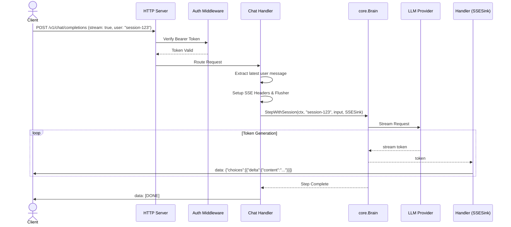

# Architecture and Design: OpenAI-Compatible REST API Server & Expanded LLM Providers

This document outlines the architecture, component design, security model, and testing strategy for the `api-server-and-providers` change in the AGIS project.

## 1. Architecture Decision Records (ADRs)

### D1: Server Package Architecture (`internal/server/`)
We will introduce a new `internal/server/` package to encapsulate the HTTP API logic. The architecture will follow standard Go HTTP idioms with a clear separation of concerns:
- **Router**: Uses `http.ServeMux` to map paths (`/v1/chat/completions`, `/v1/models`, `/v1/health`, `/healthz`).
- **Middleware**: Chain for CORS (`corsMiddleware`) and Authentication (`authMiddleware`).
- **Handlers**: Specific handler structs/functions for chat completions, model enumeration, and health checks.
- **Graceful Shutdown**: The `Server` struct will manage an `http.Server` and expose a `Shutdown(ctx)` method to drain active requests safely.

### D2: Concurrent Session & Brain Execution Strategy
The `core.Brain` component is stateful (it manages an `activeID`). To support concurrent API requests safely without global race conditions:
- The server will extract the session ID from the `X-Session-ID` header or the `user` field in the request payload.
- We will use a `session.Manager` (or similar session registry) to resolve or create the session context.
- We will execute `core.Brain.Step` inside a request-scoped environment. If `Brain` cannot be instantiated cheaply per request, we will modify or wrap it to support a `StepWithSession(ctx, sessionID, input, sink)` method, preventing data races on global state.
- The server extracts only the *newest* user message to pass into the Brain, treating AGIS as the stateful memory manager.

### D3: SSE Streaming Architecture
For `stream: true` in `/v1/chat/completions`, we will use Server-Sent Events (SSE).
- The HTTP handler will assert that the `http.ResponseWriter` implements `http.Flusher`.
- A request-scoped `Sink` implementation will be passed to `Brain.Step`. As the Brain produces output tokens, this `Sink` will immediately format them into OpenAI-compatible SSE chunks (`data: {"id":..., "choices":[{"delta":{"content":"..."}}]}\n\n`) and call `Flush()`.
- Upon normal completion, a terminal chunk with `finish_reason: "stop"` and a final `data: [DONE]\n\n` will be emitted.

### D4: Constant-Time Token Authentication & CORS Middleware
To prevent timing attacks on API keys, the authentication middleware will use `crypto/subtle.ConstantTimeCompare` when comparing the provided Bearer token against `ServerConfig.APIKey`. If the API Key is empty, the middleware bypasses authentication (open mode).
CORS middleware will intercept `OPTIONS` requests, returning HTTP 204 with the headers defined in `ServerConfig.CORSOrigins`.

### D5: Universal LLM Provider Presets & Catalog Architecture
The `internal/adapters/llm/` factory will be expanded.
- **Presets**: `presets.go` will map provider names (e.g., `openai`, `ollama`, `deepseek`, `gemini`) to their default Base URLs.
- **Anthropic Native Adapter**: Since Anthropic's API (`/v1/messages`) significantly deviates from OpenAI, we will create `internal/adapters/llm/anthropic.go`. This adapter will natively handle Anthropic's headers, message formats, and specific SSE stream events (`content_block_delta`).
- **Cohere Adapter**: A dedicated shim or native implementation will be placed in `cohere.go` if required by compatibility constraints.

### D6: Configuration Extension
We will extend `internal/config/config.go` with a new `ServerConfig` struct:
```go
type ServerConfig struct {
    Enabled      bool          `yaml:"enabled"`
    Host         string        `yaml:"host"`
    Port         int           `yaml:"port"`
    APIKey       string        `yaml:"api_key"`
    CORSOrigins  []string      `yaml:"cors_origins"`
    ReadTimeout  time.Duration `yaml:"read_timeout"`
    WriteTimeout time.Duration `yaml:"write_timeout"`
}
```
`config.MaskConfig(cfg)` will be updated to mask `cfg.Server.APIKey` (`sk-***`).

### D7: Health Diagnostic Probes
In `internal/doctor`, new probes will be added:
- **Server Probe**: Verifies that the `Host:Port` is bindable. Emits a `StatusWarn` if `Host` is `0.0.0.0` and `APIKey` is empty.
- **Provider Probes**: Pings the resolved Base URLs for active and fallback LLM providers to ensure reachability and valid credentials.

## 2. Component Interactions & Sequence Diagrams

### Chat Completion Flow (Streaming)


## 3. Data Structures, Types & Method Signatures

### Server Package
```go
package server

type ServerOptions struct {
    Host         string
    Port         int
    APIKey       string
    CORSOrigins  []string
    ReadTimeout  time.Duration
    WriteTimeout time.Duration
    // Dependency Injection
    BrainRunner  BrainRunner // Interface wrapping Brain execution
    Logger       *slog.Logger
}

type Server struct {
    httpServer *http.Server
    opts       ServerOptions
}

func NewServer(opts ServerOptions) *Server
func (s *Server) Start() error
func (s *Server) Shutdown(ctx context.Context) error
```

### API Schemas (OpenAI Compatible)
```go
type ChatCompletionRequest struct {
    Model       string                  `json:"model,omitempty"`
    Messages    []ChatCompletionMessage `json:"messages"`
    Stream      bool                    `json:"stream,omitempty"`
    Temperature float32                 `json:"temperature,omitempty"`
    User        string                  `json:"user,omitempty"`
}

type ChatCompletionMessage struct {
    Role    string `json:"role"`
    Content string `json:"content"` // Simplified; arrays supported if multimodal needed
}

type ChatCompletionChunk struct {
    ID      string             `json:"id"`
    Object  string             `json:"object"`
    Created int64              `json:"created"`
    Model   string             `json:"model"`
    Choices []ChunkChoice      `json:"choices"`
}

type ChunkChoice struct {
    Index        int         `json:"index"`
    Delta        ChunkDelta  `json:"delta"`
    FinishReason *string     `json:"finish_reason"`
}

type ChunkDelta struct {
    Content string `json:"content,omitempty"`
}
```

### LLM Adapters
```go
package llm

// Presets registry mapping provider string to BaseURL.
var ProviderPresets = map[string]string{
    "deepseek": "https://api.deepseek.com/v1",
    "openai":   "https://api.openai.com/v1",
    // ...
}

// Anthropic specific structures
type AnthropicAdapter struct {
    client *http.Client
    apiKey string
    // ...
}
func (a *AnthropicAdapter) Chat(ctx context.Context, req core.ChatRequest) (core.ChatResponse, error)
func (a *AnthropicAdapter) Stream(ctx context.Context, req core.ChatRequest) (<-chan core.StreamEvent, error)
```

## 4. Security, Threat Modeling & Defensive Design

- **Authentication Bypass / Spoofing**: Mitigated by strict `Authorization: Bearer` checks.
- **Timing Attacks**: Token verification utilizes `crypto/subtle.ConstantTimeCompare` to avoid byte-by-byte comparison leaks.
- **Denial of Service (DoS)**: 
  - Implementation of `http.MaxBytesReader` to limit the size of incoming JSON payloads.
  - Strict `ReadTimeout`, `WriteTimeout`, and `IdleTimeout` defined on the `http.Server` to prevent resource exhaustion from slow-loris attacks.
- **Information Disclosure**: Error handling sanitization ensures that internal stack traces or database/repository errors are not leaked to external clients. Generic OpenAI-style errors (`invalid_request_error`, `api_error`) are returned instead.
- **Cross-Site Request Forgery (CSRF) & XSS**: Protected by configurable CORS policies. Preflight requests are strictly evaluated.

## 5. Testing Strategy

Following `golang-testing` conventions:
- **Unit Tests (`internal/server_test/`)**: 
  - Use `httptest.NewServer` and `httptest.ResponseRecorder` to validate routing, middleware (CORS, Auth), and status codes.
  - Test missing token, wrong token (HTTP 401), and successful open mode (HTTP 200).
- **Streaming Tests**:
  - Table-driven tests validating SSE chunk generation (`data: ... \n\n`), asserting correct sequence and the final `[DONE]` marker.
- **Anthropic/Cohere Adapter Tests**:
  - Use mocked HTTP clients (via `httptest`) returning static JSON/SSE fixtures from Anthropic API documentation.
  - Assert that `core.ChatRequest` translates correctly to `messages` and `system` payloads.
- **Concurrency & Resource Leaks**:
  - Use `go test -race ./...` to detect data races in concurrent session handling and SSE flushing.
  - Implement `goleak.VerifyTestMain` to ensure streaming connections closing prematurely do not leak `Brain.Step` goroutines.
- **Integration Tests**: 
  - Tagged with `//go:build integration`. Will test the CLI command `agis serve` lifecycle and graceful shutdown logic (sending SIGTERM and awaiting safe termination).
