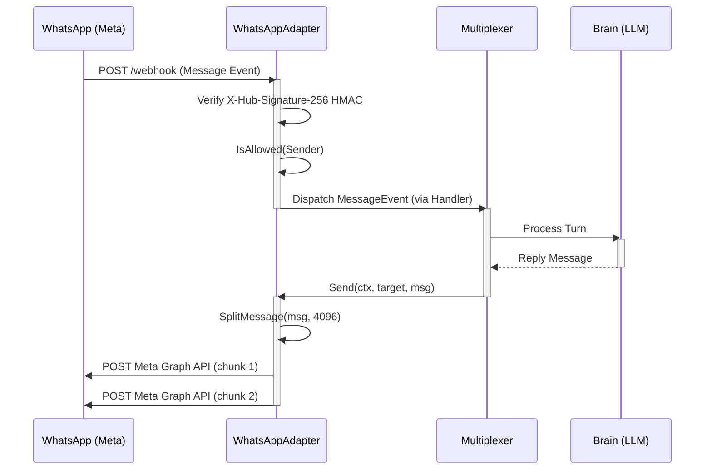
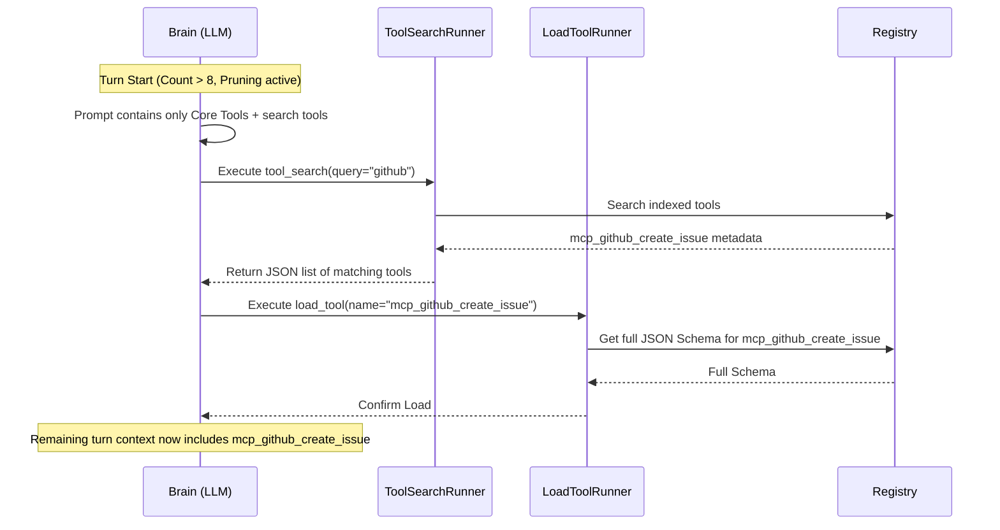

# Design: gateways-and-tool-search

## 1. Architecture Decision Records (ADRs)

### D1: Slack Gateway Adapter
- **Location**: `internal/gateway/slack.go`
- **Responsibility**: Provide HTTP webhook endpoints to receive Slack Events API callbacks.
- **Key Decisions**:
  - Implement `gateway.Adapter` interface.
  - HTTP Server for receiving Events (`/slack/events` on `ListenAddr` default `:3002`).
  - Strict security validation: Constant-time `X-Slack-Signature` HMAC verification (`crypto/subtle.ConstantTimeCompare`).
  - Replay attack mitigation: Verify timestamp freshness (`X-Slack-Request-Timestamp` < 300s).
  - Outbound handling: Use `chat.postMessage` via Slack Web API, chunk messages over 4000 characters, and retain `thread_ts` for thread consistency.

### D2: WhatsApp Gateway Adapter
- **Location**: `internal/gateway/whatsapp.go`
- **Responsibility**: Provide Meta Cloud API Webhook integration for WhatsApp messages.
- **Key Decisions**:
  - Implement `gateway.Adapter` interface.
  - HTTP Server for webhooks (GET for setup handshake using `hub.challenge`, POST for payloads).
  - Signature validation: Verify `X-Hub-Signature-256` HMAC with Meta app secret via `crypto/subtle.ConstantTimeCompare`.
  - Media handling: Download voice notes, enforcing size limits, and transcribe using `core.Transcriber.Transcribe` (Whisper).
  - Outbound handling: Chunk texts exceeding 4096 runes and deliver via Meta Graph API.

### D3: Multiplexer Integration
- **Location**: `internal/gateway/multiplexer.go` (existing)
- **Responsibility**: Wire the newly created adapters (Slack and WhatsApp) into the active Multiplexer instance alongside Telegram and Discord when their respective `Enabled` flags are `true`.

### D4: Dynamic Tool Search & Lazy Loading Engine
- **Location**: `internal/tools/` and `internal/core/brain.go`
- **Responsibility**: Mitigate context bloat when the total number of tools exceeds a specified threshold.
- **Key Decisions**:
  - Implement `tool_search` and `load_tool` as `core.ToolRunner` implementations.
  - **Pruning**: In `Brain.Step`, if `tools.tool_search.enabled: true` and tool count > `threshold` (default 8), only core tools (`web_search`, `web_fetch`, `delegate_task`, `local`, `shell-*`) + `tool_search` + `load_tool` are injected into `ChatRequest.Tools`.
  - **Lazy Loading**: When `load_tool` is executed, the requested tool schema is dynamically fetched from the registry and injected into the active prompt context for subsequent turns.

### D5: Configuration & Secret Masking
- **Location**: `internal/config/config.go` and `internal/config/mask.go`
- **Key Decisions**:
  - Add `SlackConfig` and `WhatsAppConfig` under `GatewayConfig`.
  - Add `ToolSearchConfig` under `ToolsConfig`.
  - Ensure all tokens/secrets (`BotToken`, `SigningSecret`, `APIToken`, `VerifyToken`, `AppSecret`) are masked with `"[MASKED]"` during logging via `mask.go`.

### D6: Doctor Diagnostic Probes
- **Location**: `internal/doctor/`
- **Key Decisions**:
  - Implement `checkSlackGateway`, `checkWhatsAppGateway`, and `checkToolSearch`.
  - Validate required properties and configurations are present when enabled, issuing `StatusFail` on missing secrets and `StatusWarn` on empty allowlists.

## 2. Component Interactions & Sequence Diagrams

### WhatsApp Interaction Sequence



### Dynamic Tool Search Sequence



## 3. Data Structures, Types & Method Signatures

### Slack Adapter
```go
package gateway

type SlackAdapter struct {
    config  config.SlackConfig
    handler Handler
    client  *http.Client
    server  *http.Server
}

func (s *SlackAdapter) Name() string
func (s *SlackAdapter) Start(ctx context.Context) error
func (s *SlackAdapter) Stop() error
func (s *SlackAdapter) Send(ctx context.Context, target string, msg string) error
func (s *SlackAdapter) verifyHMAC(headerSignature, timestamp string, body []byte) bool
```

### WhatsApp Adapter
```go
package gateway

type WhatsAppAdapter struct {
    config      config.WhatsAppConfig
    handler     Handler
    client      *http.Client
    server      *http.Server
    transcriber core.Transcriber
}

func (w *WhatsAppAdapter) Name() string
func (w *WhatsAppAdapter) Start(ctx context.Context) error
func (w *WhatsAppAdapter) Stop() error
func (w *WhatsAppAdapter) Send(ctx context.Context, target string, msg string) error
func (w *WhatsAppAdapter) verifyWebhook(r *http.Request) (string, error)
func (w *WhatsAppAdapter) verifyHMAC(headerSignature string, body []byte) bool
```

### Tool Runners
```go
package tools

type ToolSearchRunner struct {
    registry *core.Registry
}

func (t *ToolSearchRunner) Name() string
func (t *ToolSearchRunner) Execute(ctx context.Context, args json.RawMessage) (json.RawMessage, error)

type LoadToolRunner struct {
    registry *core.Registry
}

func (l *LoadToolRunner) Name() string
func (l *LoadToolRunner) Execute(ctx context.Context, args json.RawMessage) (json.RawMessage, error)
```

## 4. Security, Threat Modeling & Defensive Design

### Verification and Validations
- **HMAC Comparison**: Signatures for both Slack and WhatsApp MUST be verified using `crypto/subtle.ConstantTimeCompare` to avoid timing side-channel attacks during signature validation.
- **Timestamp Freshness**: Slack's payload includes a timestamp. If `|current_time - timestamp| > 300s`, drop the request to mitigate replay attacks.
- **Payload Limits**: Inbound payloads should be processed using `io.LimitReader` to protect against DoS attacks from unusually large requests. Audio files on WhatsApp must enforce the strict 25MB constraint before transcription.

### Data Privacy & Masking
- All authorization tokens (`BotToken`, `SigningSecret`, `APIToken`, `AppSecret`, `VerifyToken`) must be redacted at the configuration level (`internal/config/mask.go`) ensuring they are never logged inadvertently to stdout or persistent logs.

## 5. Testing Strategy

### Integration & Unit Tests
- **Gateway Webhooks**: Utilize `httptest.Server` to mock out Slack API and Meta Graph API endpoints during `Send` validations. Use `httptest.NewRequest` and `httptest.ResponseRecorder` to inject verified and forged HMAC requests into the webhooks to assure proper behavior (200 vs 401).
- **Concurrency & Leaks**: Ensure that `TestMain` executes `goleak.VerifyTestMain` for the gateway package. Tests instantiating web servers for Slack and WhatsApp MUST `Stop()` properly and wait for graceful shutdowns.
- **Table-Driven Tests**: `tool_search` and `load_tool` will use standard table-driven definitions evaluating multiple scenarios (e.g., matching partial names, categories, invalid name handling).
- **Race Detection**: Use `-race` flag for all unit testing, as the Multiplexer and asynchronous handling of incoming requests are prone to race conditions if map or slice access isn't properly synchronized.
