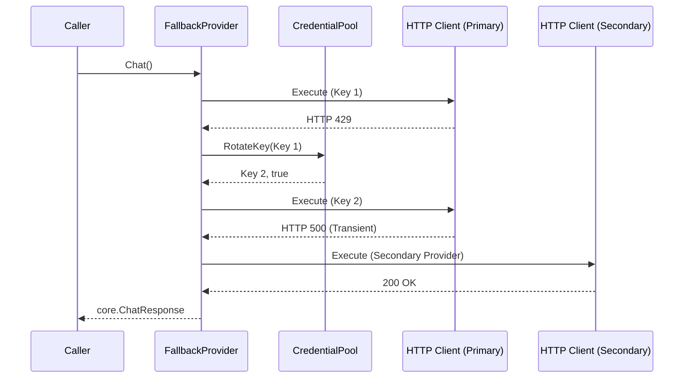
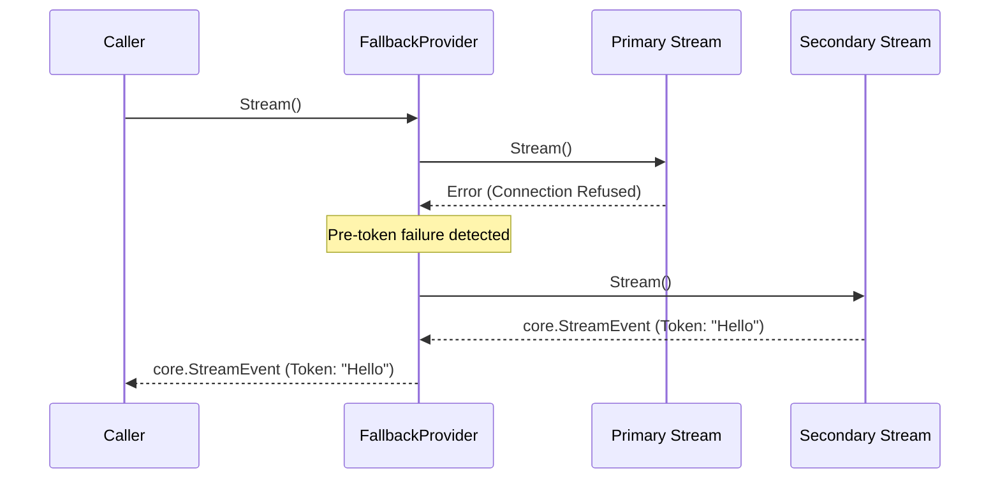

# Architecture and Design: LLM Resilience

## 1. Architecture Decision Records (ADRs)

### D1: Composite Provider Pattern (`FallbackProvider`)
- **Location**: `internal/adapters/llm/fallback.go`
- **Decision**: We will implement `FallbackProvider` as a composite that adheres to the `core.Provider` interface. It will hold a slice of `core.Provider` instances (index 0 is primary, 1..N are fallbacks).
- **Rationale**: This is transparent to `core`. The core application logic does not need to know whether it's talking to OpenAI directly or a chain of providers.

### D2: Transient vs Fatal Error Classifier
- **Location**: `internal/adapters/llm/errors.go`
- **Decision**: Create `isTransientError(err error) bool`.
- **Rationale**: We must fail-fast on user errors (400, 404, context cancel) but retry on infrastructure errors (429, 5xx, EOF, net timeouts). HTTP 401 is fatal *unless* we have remaining unexhausted keys in the pool.

### D3: Thread-Safe `CredentialPool` Design
- **Location**: `internal/adapters/llm/pool.go`
- **Decision**: Manage API keys with a dedicated `CredentialPool` containing `keys []string`, `currentIndex int`, and a `sync.RWMutex`.
- **Rationale**: High-throughput environments (concurrent goroutines) might hit 429s simultaneously. `RotateKey(failedKey string) (string, bool)` avoids the "stampeding herd" problem. If `currentKey != failedKey`, another goroutine has already rotated the key, and we just return the new one without advancing.

### D4: Pre-token vs Mid-stream State Machine
- **Location**: `internal/adapters/llm/fallback.go` (in the `Stream` method)
- **Decision**: If `Stream()` yields an error before emitting any tokens (checked via a local flag in the wrapper goroutine), we cancel the context of that provider, close its resources, and instantiate a stream with the next provider. If `tokensEmitted > 0`, we pass the error down and close the channel.
- **Rationale**: Retrying mid-stream results in duplicated prefixes and corrupted text. Failover must be completely seamless (pre-token) or explicitly terminated (mid-stream).

### D5: Auxiliary Provider Resolution & Factory
- **Location**: `internal/adapters/llm/provider.go`
- **Decision**: Implement `NewProviderForTask(baseCfg, taskProvider, taskModel) core.Provider`.
- **Rationale**: Allows the vision, memory, and audio sub-systems to instantiate their own isolated `core.Provider` variants, falling back to the base `LLMConfig` defaults if no overrides are specified.

### D6: Configuration Extension & Deep Secret Masking
- **Location**: `internal/config/config.go` & `internal/config/mask.go`
- **Decision**: Add `api_keys` and `fallbacks` arrays. Deep-copy in `MaskSecrets` and overwrite all `APIKey` and `APIKeys` entries with `[MASKED]`.
- **Rationale**: Logging configs or errors must never leak plaintext keys.

### D7: Diagnostic Probe Architecture
- **Location**: `internal/doctor/doctor.go`
- **Decision**: The `checkLLM` function will test the primary provider. If it fails, it sets a local failure flag and iterates over fallbacks. If any fallback succeeds, the final status is `StatusWarn`. If all fail, `StatusFail`.
- **Rationale**: Gives administrators instant visibility into whether an outage is a full system down or successfully mitigated by fallbacks.

## 2. Component Interactions & Sequence Diagrams





## 3. Data Structures, Types & Method Signatures

```go
// internal/config/config.go
type LLMConfig struct {
    Provider  string              `yaml:"provider"`
    Model     string              `yaml:"model"`
    APIKey    string              `yaml:"api_key"`
    APIKeys   []string            `yaml:"api_keys"`
    BaseURL   string              `yaml:"base_url,omitempty"`
    Fallbacks []LLMFallbackConfig `yaml:"fallbacks"`
}

type LLMFallbackConfig struct {
    Provider string   `yaml:"provider"`
    Model    string   `yaml:"model"`
    APIKey   string   `yaml:"api_key"`
    APIKeys  []string `yaml:"api_keys"`
    BaseURL  string   `yaml:"base_url,omitempty"`
}

// internal/adapters/llm/pool.go
type CredentialPool struct {
    keys  []string
    idx   int
    mutex sync.RWMutex
}
func NewCredentialPool(primaryKey string, keys []string) *CredentialPool
func (p *CredentialPool) CurrentKey() string
func (p *CredentialPool) RotateKey(failedKey string) (nextKey string, hasMore bool)
func (p *CredentialPool) Len() int

// internal/adapters/llm/errors.go
func isTransientError(err error) bool

// internal/adapters/llm/fallback.go
type FallbackProvider struct {
    providers []core.Provider
}
func NewFallbackProvider(primary core.Provider, fallbacks ...core.Provider) *FallbackProvider
func (f *FallbackProvider) Chat(ctx context.Context, req core.ChatRequest) (*core.ChatResponse, error)
func (f *FallbackProvider) Stream(ctx context.Context, req core.ChatRequest) (<-chan core.StreamEvent, error)
func (f *FallbackProvider) Models(ctx context.Context) ([]string, error)

// internal/adapters/llm/provider.go
func NewProviderForTask(baseCfg config.LLMConfig, taskProvider, taskModel string) core.Provider
```

## 4. Security, Threat Modeling & Defensive Concurrency

1.  **Goroutine Leak Prevention**: 
    - When `Stream()` fails pre-token and failover happens, the initial provider's context (created with `context.WithCancel(ctx)`) must be canceled.
    - We must exhaust/close the failed provider's channel to free up its internal goroutines.
2.  **Secret Masking**: 
    - Masking is strictly applied to `APIKeys` slice and `Fallbacks` items in `MaskSecrets`. 
    - Error strings originating from third-party HTTP clients must be stripped of `Bearer sk-...` if the third-party client accidentally includes it in a dumped request representation.
3.  **Defensive Concurrency**: 
    - `CredentialPool` uses `sync.RWMutex`.
    - Rotating checks: `if p.keys[p.idx] != failedKey { return p.keys[p.idx], true }`. This bounds the race condition where 100 requests fail simultaneously on key A; only the first increments `p.idx`.

## 5. Testing Strategy

- **Table-Driven Transient Error Classification**: Iterate over constructed `http.Response` errors (400, 401, 429, 500, etc.) and `net.Error` timeouts to assert `isTransientError` behavior.
- **HTTP 429 Key Rotation Tests**: Build an `httptest.Server` that returns 429 for `"Bearer key1"` and 200 for `"Bearer key2"`. Verify the adapter seamlessly returns the correct payload.
- **Race Detection (`-race`)**: Spawn 50 goroutines attempting to execute a request that triggers a 429, ensuring `RotateKey` does not panic and only increments index minimally.
- **Streaming Failover & `goleak`**:
    - *Pre-token*: Mock primary provider to return `StreamEvent{Err: timeout}` immediately. Assert the caller gets tokens from the secondary mock.
    - *Mid-stream*: Mock primary provider to return `"prefix"`, then `Err: timeout`. Assert no fallback is triggered and the channel is closed with the error.
    - Wrap stream tests in `goleak.VerifyNone(t)` to ensure aborted stream goroutines do not linger.
