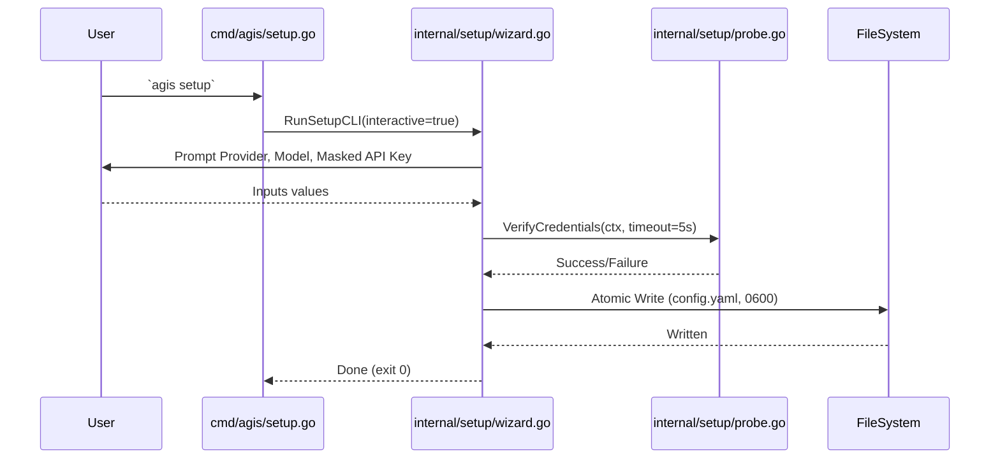
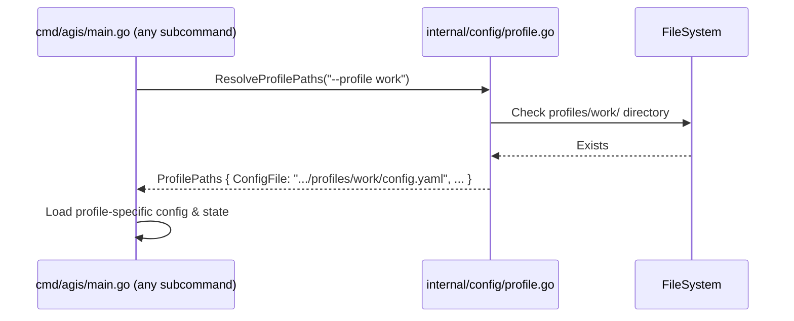

# SDD Architecture and Design: Setup Wizard & Multi-Profile Management

## 1. Architecture Decision Records (ADRs)

### D1: Setup Wizard Architecture
- **Components:** `cmd/agis/setup.go` (CLI entry point) and `internal/setup/wizard.go` (core logic).
- **Interactive Flow:** The wizard uses a TTY prompt loop for user input, featuring masked password reading for API keys to prevent terminal echo.
- **Connectivity Probe:** A live validation probe will verify LLM credentials and reachability before persisting configuration, strictly bounded by a 5-second timeout (`context.WithTimeout`).
- **Headless Mode:** The setup architecture natively supports a `-non-interactive` flag to bypass the prompt loop and rely entirely on provided CLI arguments, useful for automation and CI environments.

### D2: Profile Path Resolution Engine
- **Component:** `internal/config/profile.go`
- **Core Function:** `ResolveProfilePaths(customProfile string) ProfilePaths` will be the centralized authority for determining the base directory and file paths for AGIS state.
- **Precedence:** Explicit CLI flag (`--profile`) > Environment Variable (`AGIS_PROFILE`) > Active Profile Pointer (`.active_profile`) > Default Root (`$AGIS_HOME`).
- **Isolation:** No component should construct paths via `os.Getenv("AGIS_HOME")` directly. All file I/O operations for DB, config, SOUL, and skills must strictly route through the resolution engine.

### D3: Global Profile Flag Interception
- **Component:** `cmd/agis/main.go`
- **Mechanism:** Global `-profile` / `--profile` interception must happen early during CLI startup, prior to subcommand routing.
- **Implementation:** The root command's `PersistentPreRunE` (if Cobra is used, or an equivalent early parser) extracts the profile name and initializes the active profile context, ensuring individual subcommand parsers (`flag.FlagSet`) remain unaffected and inherit the resolved context natively.

### D4: Profile Management Engine
- **Component:** `internal/config/profile_manager.go` (or `internal/profile/manager.go`)
- **Operations:** Implements core functions: `List`, `Create`, `Clone`, `Show`, `Use` (Switch), and `Delete`.
- **Cloning Behavior:** Cloning duplicates `config.yaml`, `SOUL.md`, `policy.yaml`, and the `skills/` directory from the source profile, but intentionally creates a fresh `agis.db` to maintain separated conversation histories.

### D5: Atomic File & Directory Permissions
- **Mechanism:** Strict POSIX permission enforcement for all generated files and directories.
- **Directories:** Created with mode `0700` (`-rwx------`).
- **Files:** Configurations (e.g., `config.yaml`) written to a temporary file, flushed, `chmod`ed to `0600` (`-rw-------`), and atomically renamed over the target path to prevent data races and exposure of credentials.

### D6: Doctor Diagnostic Probe for Profile Health
- **Component:** `internal/doctor/profile_check.go` (integrating with `internal/doctor`)
- **Probes:** `checkProfile` will validate the active profile pointer correctness, ensure profile directory structures exist, and verify that configuration files conform to `0600` permission rules.

## 2. Component Interactions & Sequence Diagrams

### Setup Wizard Execution


### Profile Resolution Flow


## 3. Data Structures, Types & Method Signatures

### Types
```go
package config // or internal/profile

// ProfilePaths holds resolved paths for the active AGIS context.
type ProfilePaths struct {
    HomeDir           string
    ConfigFile        string
    DBFile            string
    SoulFile          string
    SkillsDir         string
    PolicyFile        string
    ActiveProfileName string
    IsDefault         bool
}

// ProfileInfo holds metadata for a discovered profile.
type ProfileInfo struct {
    Name     string `json:"name"`
    Path     string `json:"path"`
    IsActive bool   `json:"is_active"`
}

// ProfileManager abstracts the multi-profile subsystem.
type ProfileManager interface {
    List() ([]ProfileInfo, error)
    Create(name, cloneSource string) error
    Delete(name string, force bool) error
    Show(name string) (ProfileInfo, error)
    Switch(name string) error
    Resolve(override string) (ProfilePaths, error)
}
```

```go
package setup

// SetupOptions holds the configuration requested by the wizard or CLI args.
type SetupOptions struct {
    Provider string
    Model    string
    APIKey   string
    BaseURL  string
    Force    bool
}

// SetupResult represents the outcome of the setup operation.
type SetupResult struct {
    Success    bool
    ConfigPath string
    Error      error
}

// WizardPrompt handles terminal interaction logic.
type WizardPrompt interface {
    AskText(prompt, defaultValue string) (string, error)
    AskPassword(prompt string) (string, error)
    AskChoice(prompt string, choices []string) (string, error)
}
```

## 4. Security, Threat Modeling & Defensive CLI Design

- **Path Traversal Prevention:** Profile names must be strictly validated against the regex `^[a-zA-Z0-9_-]+$`. This blocks directory traversal sequences (`../`) and prevents profile operations from acting outside the designated `$AGIS_HOME/profiles/` directory boundary.
- **Credential Masking:** The TTY prompt for API keys will use masked input logic (not echoing keystrokes) to prevent secrets from being exposed on-screen or captured in terminal scrollback buffers. Command-line history leakage is inherently avoided when using the interactive wizard instead of passing the `--api-key` flag.
- **Strict File Permissions:** Atomic writes to `config.yaml` enforce a `0600` permission mask, mitigating local privilege escalation and unauthorized cross-user secret extraction.
- **Deletion Guards:** The `agis profile delete` command explicitly rejects deleting the currently active profile (or the `"default"` profile) unless a `-force` flag is supplied.

## 5. Testing Strategy

- **Interactive Wizard (`internal/setup/wizard_test.go`):** Utilize mock TTY readers (`bytes.Buffer`) and writers to simulate user input. Validate that prompts correctly handle empty inputs (falling back to defaults) and properly map parsed configurations.
- **Network Probes (`internal/setup/probe_test.go`):** Spin up `httptest.Server` instances to simulate success (`HTTP 200`), authorization failures (`HTTP 401`), and artificial delays (to verify the 5-second `context.WithTimeout` aborts correctly).
- **Profile Name Validation:** Employ standard table-driven tests checking both valid inputs (`work`, `test-123`) and malicious payload attempts (`../../../etc/passwd`, `foo/bar`).
- **File System Lifecycle Tests:** Validate `ProfileManager` by setting a temporary `$AGIS_HOME` environment (`t.TempDir()`), testing the complete lifecycle (creation, cloning, switching, and deletion), and verifying resulting modes (`0700` and `0600`) via `os.Stat`.
