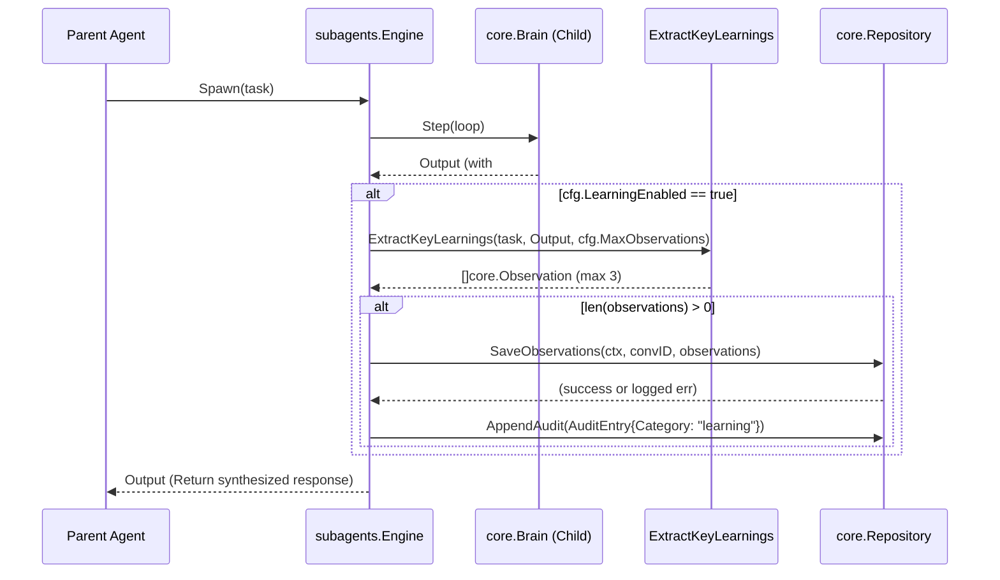

# SDD Architecture and Design (subagent-memory-learning)

## 1. Architecture Decision Records (ADRs)

### D1: Passive Distillation Regex & Markdown Parser
- **Context**: Subagents synthesize outputs which may contain implicit or explicit learning outcomes. We need a way to extract these into actionable memory without launching full secondary LLM extraction calls for every task.
- **Decision**: Implement a passive parsing function `ExtractKeyLearnings(task string, output string, maxObs int) []core.Observation` in `internal/subagents/distill.go`.
- **Details**:
  - The parser searches for headers like `## Key Learnings`, `## Discoveries`, `## Key Takeaways`, or `## Decisions` (case-insensitive, optional trailing colons).
  - It extracts ordered/unordered list items directly beneath these headings.
  - White space and list markers (`*`, `-`, `1.`) are stripped.
  - This design prefers reliability and low token cost. Regex and string split operations will be heavily tested with table-driven boundaries.

### D2: Distillation Hook in `subagents.Engine.Spawn`
- **Context**: Once a subagent finishes processing, if it generated learnings, these must be ingested by the parent system.
- **Decision**: Embed the post-turn knowledge extraction directly before `Engine.Spawn` returns.
- **Details**:
  - A successful `core.Brain.Step` completion loop will trigger `ExtractKeyLearnings`.
  - Non-blocking writes: Call `e.parent.SaveObservations()` and `e.parent.AppendAudit()` synchronously but handle errors as warnings. Graceful degradation dictates that if memory persistence fails, the subagent response still successfully bubbles up to the caller without crashing.

### D3: Namespaced Topic Key & Type Strategy
- **Context**: Core observations use `TopicKey` values for Hybrid RRF Search.
- **Decision**: Subagent distilled observations will use predictable prefix namespaces.
- **Details**:
  - Format: `subagent/<sanitized-task-slug>/<identifier>`.
  - `<sanitized-task-slug>` limits to 32 alphanumeric and hyphenated characters.
  - `<identifier>` uses a deterministic sequence index (or hash) to avoid overwriting distinct bullet points.
  - `Type` mappings: `## Decisions` -> `decision`, others -> `discovery`.
  - Importance defaults to `3`.

### D4: Configuration Extension & Hard Boundary Clamping
- **Context**: Distillation behavior must be opt-out and strictly bounded to prevent context window explosion or DB spam.
- **Decision**: Extend `internal/config.SubagentsConfig`.
- **Details**:
  - Add `LearningEnabled bool` (default `true`) and `MaxObservations int` (default `3`).
  - Strict clamping: `MaxObservations <= 0` resets to `3`; `> 5` clamps to `5`.

### D5: Doctor Diagnostics Probe Extension
- **Context**: Operational visibility into subagent constraints is currently lacking the new parameters.
- **Decision**: Extend `internal/doctor/subagents.go` (`checkSubagents`).
- **Details**:
  - Add probes to report `"Learning enabled: <status>"` and `"Max observations per task: <limit>"`.

## 2. Component Interactions & Sequence Diagrams

### Distillation Sequence


## 3. Data Structures, Types & Method Signatures

### Configuration
`internal/config/config.go`:
```go
type SubagentsConfig struct {
    Enabled         bool          `yaml:"enabled"`
    MaxConcurrent   int           `yaml:"max_concurrent"`
    MaxDepth        int           `yaml:"max_depth"`
    DefaultTimeout  time.Duration `yaml:"default_timeout"`
    MaxTurns        int           `yaml:"max_turns"`
    LearningEnabled bool          `yaml:"learning_enabled"`
    MaxObservations int           `yaml:"max_observations"`
}
```

### Distillation Package
`internal/subagents/distill.go` (new file):
```go
// ExtractKeyLearnings parses output text for markdown sections containing structured learning points.
// task is the raw subagent prompt used to generate a sanitized topic key.
func ExtractKeyLearnings(task string, output string, maxObs int, convID string) []core.Observation

// sanitizeTaskSlug converts a prompt into a 32-char alphanumeric-and-hyphen slug.
func sanitizeTaskSlug(task string) string
```

### Core Engine Update
`internal/subagents/engine.go`:
Update `Engine.Spawn` signature (conceptual):
```go
func (e *Engine) Spawn(ctx context.Context, task string, maxTurns int) (string, error) {
    // ... setup and step loop ...
    
    // Post-completion distillation hook
    if e.config.LearningEnabled && e.parent != nil {
        observations := ExtractKeyLearnings(task, synthesizedOutput, e.config.MaxObservations, e.convID)
        if len(observations) > 0 {
            err := e.parent.SaveObservations(ctx, e.convID, observations)
            if err != nil {
                slog.Warn("failed to persist subagent learnings", "err", err)
            } else {
                e.parent.AppendAudit(core.AuditEntry{
                    Backend:  "subagent",
                    Category: "learning",
                    Decision: "allow",
                    Subject:  fmt.Sprintf("distilled %d observations from subagent task: %s", len(observations), task),
                })
            }
        }
    }
    
    return synthesizedOutput, nil
}
```

## 4. Security, Threat Modeling & Defensive Memory I/O

- **Sanitization (Threat: Invalid Topic Keys)**: Task prompts can contain arbitrary characters, spaces, or slashes which might break DB queries or path structures. `sanitizeTaskSlug` enforces strict lowercase alphanumeric + hyphens matching `[a-z0-9-]+` and truncates at 32 characters.
- **Graceful Degradation (Threat: DoS via DB locks)**: Subagents perform intensive LLM work. If SQLite locks or fails `SaveObservations`, it must strictly log the error (`slog.Warn`) but NOT `return "", err`. Failing the entire subagent run over a failed memory commit throws away tokens and user time.
- **Limit Enforcement (Threat: Memory Flooding)**: `MaxObservations` prevents unbounded extraction. Even if a subagent hallucinated 100 learnings, `config.Load()` strict clamping (max 5) and `ExtractKeyLearnings` hard cap guarantees maximum 5 insertions per run.
- **Memory Aliasing/Leaks (Threat: Leaks)**: Using `goleak` and `-race` testing strictly checks that extraction and saves do not spawn orphaned background goroutines.

## 5. Testing Strategy

Follow strict TDD (`strict-tdd.md`) using Table-driven tests:

1. **Distillation Tests** (`internal/subagents/distill_test.go`):
   - Table-driven regex parsing tests validating missing headers, ordered lists, unordered lists, trailing spaces, and max bounds enforcement.
   - Assert precise construction of `core.Observation` (slug formats, Types `decision` vs `discovery`).

2. **Engine Spawning tests** (`internal/subagents/engine_test.go`):
   - Inject a mocked `core.Repository` implementation.
   - Assert `SaveObservations` and `AppendAudit` are invoked when output holds `## Key Learnings`.
   - Assert error resilience: if the mock `SaveObservations` returns an error, `Spawn` must succeed normally.
   - Assert configuration paths: disabled learning configuration entirely skips distillation steps.

3. **Config Clamping tests** (`internal/config/config_test.go`):
   - Validate negative, zero, and extremely high values clamp strictly to fallback bounds (max=5).

4. **Doctor Probe tests** (`internal/doctor/subagents_test.go`):
   - Verify `checkSubagents` includes learning status logic formatting correctly under enabled/disabled cases.

Run using standard Go testing (`go test -race ./...`) and include `goleak.VerifyNone(t)` to satisfy standard observability checks.
