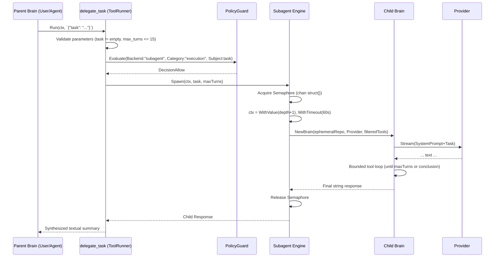

# SDD Architecture and Design: Native Subagent Delegation

## 1. Architecture Decision Records (ADRs)

### D1: Package Layout
**Decision**: The execution engine and core structures for subagents will reside in `internal/subagents/` to encapsulate concurrency management, limits, and child brain instantiation. The actual tool runner implementation will reside in `internal/tools/subagent.go` to adhere to the existing `core.ToolRunner` ecosystem. `cmd/agis/main.go` will initialize the `subagents.Engine` and inject it into the `tools.Select` factory or runner construction.

### D2: Ephemeral Repository & Session Strategy
**Decision**: We will implement an in-memory `ephemeralRepository` in `internal/subagents/ephemeral_repo.go` that implements `core.Repository`. 
- **Rationale**: It wraps the parent `core.Repository`. All read-only operations (`Search`, `Observations`, `ListSkills`, `UserModelRows`) and policy/audit logging (`AppendAudit`) delegate to the parent. Conversation and message methods (`CreateConversation`, `LatestConversation`, `AppendMessage`, `Messages`, `GetConversation`) act on an isolated, thread-safe in-memory slice. This guarantees zero pollution of the main SQLite database even if the process crashes, perfectly isolating the child's context.

### D3: Concurrency Management
**Decision**: A global channel-based semaphore (`chan struct{}`) will limit active subagent goroutines.
- **Rationale**: Created inside the `subagents.Engine` with capacity `MaxConcurrent`. Before spawning a child brain, the tool runner requests a token. If blocked, it respects `context.Context` cancellation. A `defer` releases the token immediately after execution. This prevents thread and API rate-limit starvation without complex locking.

### D4: Depth Tracking & Context Propagation
**Decision**: We will use `context.Context` with a typed key (`subagentDepthKey`) to track the current recursion depth down the call stack.
- **Rationale**: The `delegate_task` tool runner reads the depth from the `ctx` passed to `Run()`. If `depth >= MaxDepth`, it returns an error. When spawning a child, it creates a new context using `context.WithValue(ctx, subagentDepthKey, depth+1)` and `context.WithTimeout(ctx, DefaultTimeout)`.

### D5: Tool Inheritance & Filtering
**Decision**: The `subagents.Engine` will accept the parent's slice of `core.ToolRunner`. When constructing a child `core.Brain`, it will pass these runners along. If the child's depth reaches `MaxDepth`, the engine will explicitly filter out the `"subagent"` runner from the list provided to the child brain.

### D6: PolicyGuard Integration
**Decision**: In `internal/core/port_policy.go`, a new constant `CategoryExecution = "execution"` is added. The `delegate_task` runner uses backend `"subagent"`. The engine sets default tier policies for `"subagent"` during initialization or expects `PolicyGuard` to enforce `sandbox` by default. Every subagent delegation is evaluated via `GuardRequest{Backend: "subagent", Category: CategoryExecution, Subject: task}`.

### D7: Configuration Integration
**Decision**: Extend `internal/config/config.go`.
- Add `Subagents SubagentsConfig` to `Config`.
- Implement boundary clamping in `applyDefaults(cfg *Config)` (e.g., `MaxConcurrent` between 1 and 10, `MaxDepth` between 1 and 2, `MaxTurns` between 1 and 15, `DefaultTimeout` clamped at 300s).
- Unconfigured fields reset to their safe defaults.

### D8: Health Diagnostic Probe
**Decision**: Add `checkSubagents` in `internal/doctor/doctor.go` (or `probe_subagents.go`). It verifies `cfg.Subagents.Enabled` and outputs the clamped/active config values (Concurrency, Depth, Timeout, Turns). If disabled, it yields `StatusPass` with a "Subagents subsystem disabled" message.

---

## 2. Component Interactions & Sequence Diagrams



---

## 3. Data Structures, Types & Interfaces

### 3.1. `internal/config/config.go` Updates
```go
type SubagentsConfig struct {
    Enabled        bool          `yaml:"enabled"`
    MaxConcurrent  int           `yaml:"max_concurrent"`
    MaxDepth       int           `yaml:"max_depth"`
    DefaultTimeout time.Duration `yaml:"default_timeout"`
    MaxTurns       int           `yaml:"max_turns"`
}
```

### 3.2. `internal/subagents/engine.go`
```go
package subagents

import (
    "context"
    "github.com/SalvucciFacundo/agis/internal/config"
    "github.com/SalvucciFacundo/agis/internal/core"
)

type contextKey string
const depthKey contextKey = "subagentDepth"

type Engine struct {
    cfg      config.SubagentsConfig
    parent   core.Repository
    provider core.Provider
    guard    core.PolicyGuard
    approver core.Approver
    runners  []core.ToolRunner
    sem      chan struct{}
}

func NewEngine(cfg config.SubagentsConfig, parent core.Repository, provider core.Provider, guard core.PolicyGuard, approver core.Approver, runners []core.ToolRunner) *Engine {
    return &Engine{
        cfg: cfg, parent: parent, provider: provider,
        guard: guard, approver: approver, runners: runners,
        sem: make(chan struct{}, cfg.MaxConcurrent),
    }
}

// Spawn creates a child brain and runs the task, tracking depth and concurrency.
func (e *Engine) Spawn(ctx context.Context, task string, contextInfo string, maxTurns int) (string, error)
```

### 3.3. `internal/subagents/ephemeral_repo.go`
```go
package subagents

import (
    "context"
    "sync"
    "github.com/SalvucciFacundo/agis/internal/core"
)

// ephemeralRepository implements core.Repository.
// It proxies read-only and unrelated calls to 'parent', while handling
// Conversation and Message appends locally in memory.
type ephemeralRepository struct {
    parent core.Repository
    conv   core.Conversation
    msgs   []core.Message
    mu     sync.RWMutex
}

// NewEphemeralRepository(parent) ...
```

### 3.4. `internal/tools/subagent.go`
```go
package tools

import (
    "context"
    "github.com/SalvucciFacundo/agis/internal/core"
)

type SubagentSpawner interface {
    Spawn(ctx context.Context, task, contextInfo string, maxTurns int) (string, error)
}

type subagentRunner struct {
    spawner SubagentSpawner
}

func NewSubagentRunner(spawner SubagentSpawner) core.ToolRunner {
    return &subagentRunner{spawner: spawner}
}

func (r *subagentRunner) Name() string { return "delegate_task" }
func (r *subagentRunner) Backend() string { return "subagent" }
func (r *subagentRunner) Run(ctx context.Context, args string) (string, error)
```

---

## 4. Security, Threat Modeling & Defensive Concurrency

- **Goroutine Leak Prevention**: Tests will employ `goleak.VerifyNone` to guarantee that abandoned child loops or blocked semaphore acquisitions do not leak goroutines.
- **Deadlock Prevention on Semaphore**: The `engine.sem` is acquired via `select { case e.sem <- struct{}{}: ... case <-ctx.Done(): return ctx.Err() }`. This ensures context cancellation immediately aborts wait without deadlock.
- **Token Runaway Consumption**: Capped rigidly by configuration. The child `core.Brain`'s bounding logic prevents infinite loops (via `max_turns`). `DefaultTimeout` enforces a hard limit of `60s` (clamped up to `300s`) which bounds the total wall-clock time spent in API requests.
- **PolicyGuard Defense**: Every tool call inside the child brain inherits the parent's PolicyGuard rules. The act of spawning a subagent is itself protected under `CategoryExecution` (`"execution"`), rendering it subject to Sandbox denial, Standard asks, or Full allow policies.

---

## 5. Testing Strategy

1. **Table-Driven Input Validation**: Tests for `subagentRunner.Run` to verify input boundaries (`task` not empty, `max_turns` scaling/clamping, unmarshalling errors).
2. **Semaphore Exhaustion**: Concurrent `Spawn` test launching `N > MaxConcurrent` routines. Verify that exactly `MaxConcurrent` run immediately and the rest wait (or fail if timeout applies).
3. **Recursion Limit**: A mock task that attempts to call `delegate_task` recursively. Prove that at `depth == MaxDepth`, the tool is missing or errors out, avoiding infinite loops.
4. **Context Cancellation**: Initiate a slow `Spawn` via a mocked `Provider.Stream`, cancel the parent context, and assert the function unblocks immediately without goroutine leaks (`goleak.VerifyNone`).
5. **Ephemeral Repo Isolation**: Write messages to the `ephemeralRepository` and confirm `parent.AppendMessage` is never invoked, proving state does not leak to the main SQLite database.
6. **PolicyGuard Integration Tests**: Test Sandbox (default deny), Standard (ask), and explicit Deny evaluations of the `subagent` backend tool.
