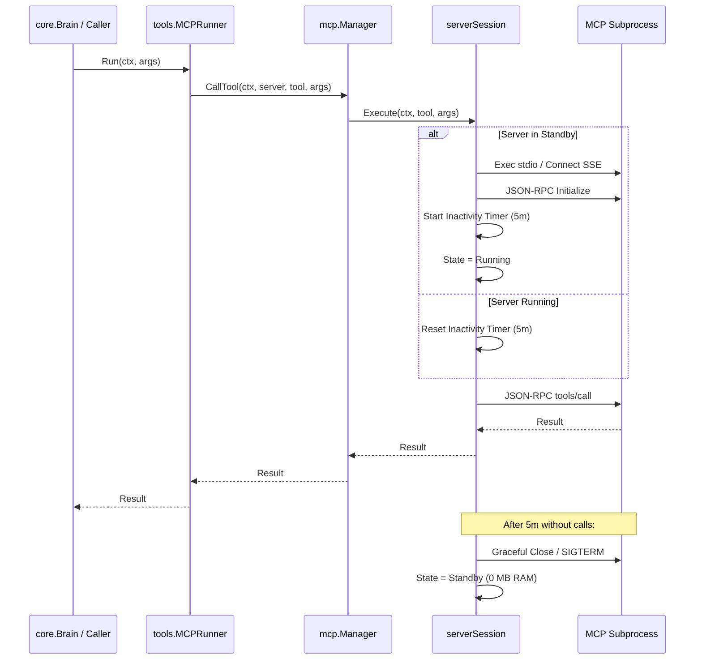

# SDD Architecture & Design: Lazy MCP Spawning & Standby Mode (lazy-mcp-standby)

## 1. Architecture Decision Records (ADRs)

### D1: Two-Phase Schema Resolution (Disk Cache First, Fallback Transient Probe)
- **Context**: In Standby mode, AGIS needs tool schemas (names, descriptions, input schemas) to construct `core.ToolRunner` instances for `core.Brain` and `Dynamic Tool Search`, but starting all MCP servers at boot negates the memory benefits.
- **Decision**: Introduce `internal/mcp/cache.go` (`SchemaCache`). When starting, `Manager` reads `<cacheDir>/<server>.json`. If valid, it registers tools directly into memory without starting any subprocess. If the cache does not exist, it runs a transient probe (launches process, fetches `tools/list`, saves cache, immediately terminates process).
- **Consequences**: Cold boot time with warm cache is <1ms. Tool schemas are durable across CLI invocations.

### D2: Synchronized Server Session Lifecycle Controller
- **Context**: In a concurrent agent system (e.g. Brain loop, subagents, or gateway events), multiple goroutines may invoke MCP tools on the same server simultaneously. Spawning duplicate child processes or racing on `client.Close()` must be prevented.
- **Decision**: Encapsulate each server's state in a `serverSession` struct with its own `sync.Mutex`, containing:
  ```go
  type serverSession struct {
      mu           sync.Mutex
      name         string
      config       config.MCPServerConfig
      state        ServerState
      client       Client
      tools        []Tool
      idleTimer    *time.Timer
      lastActivity time.Time
      idleTimeout  time.Duration
  }
  ```
  Transitions:
  - `Standby -> Starting -> Running` occurs under lock during `CallTool`.
  - `Running -> Stopping -> Standby` occurs under lock when the `idleTimer` fires or on `Stop()`.
- **Consequences**: Completely race-free under `-race` test flags. Non-interfering between different servers.

### D3: Auto-Shutdown Watchdog via `time.Timer`
- **Context**: Once a server is spawned on-demand, keeping it open forever leaks memory over long-running sessions.
- **Decision**: When entering `Running`, allocate a `time.AfterFunc(idleTimeout, session.handleIdleTimeout)`. Every subsequent `CallTool` calls `timer.Reset(idleTimeout)`. When fired, the watchdog safely invokes `client.Close()`, resets `session.client = nil`, and sets `state = StateStandby`.
- **Consequences**: After 5 minutes of inactivity, memory footprint drops back to 0 MB.

---

## 2. Component Layout & Sequence Diagrams

### On-Demand Spawning Flow:


---

## 3. Data Structures & Interfaces

```go
package mcp

type ServerState string

const (
    StateStandby  ServerState = "standby"
    StateStarting ServerState = "starting"
    StateRunning  ServerState = "running"
    StateStopping ServerState = "stopping"
    StateDisabled ServerState = "disabled"
)

type ServerStatus struct {
    Name         string      `json:"name"`
    State        ServerState `json:"state"`
    ToolCount    int         `json:"tool_count"`
    LastActivity time.Time   `json:"last_activity,omitempty"`
    Transport    string      `json:"transport"`
}

type SchemaCache interface {
    Load(serverName string) ([]Tool, bool, error)
    Save(serverName string, tools []Tool) error
    Invalidate(serverName string) error
    Clear() error
}
```
