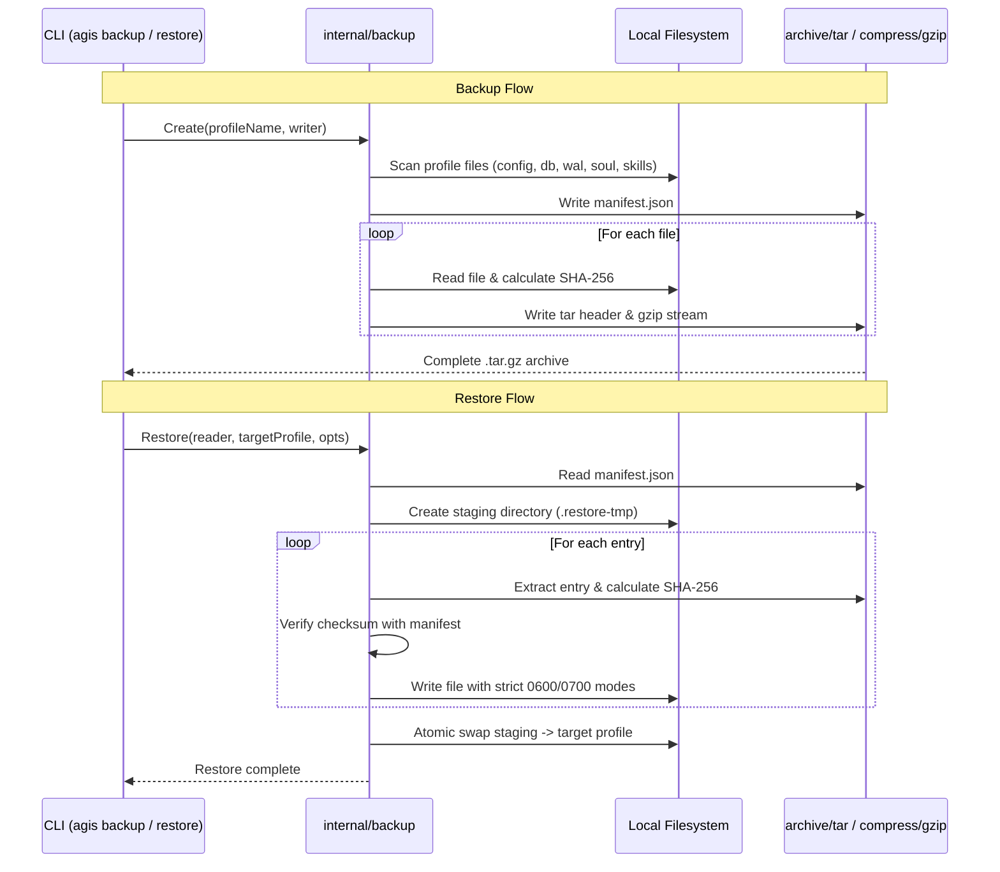

# SDD Architecture & Design: Profile Portability (profile-portability)

## 1. Architecture Decision Records (ADRs)

### D1: Streaming Tar.Gz Archive with In-Memory Manifest
- **Context**: Profiles may range from a few kilobytes (fresh profile) to tens of megabytes (long-running database with observations and embeddings). The backup creation must be efficient, portable across operating systems, and verifiable without custom dependencies.
- **Decision**: Use standard library `archive/tar` and `compress/gzip`. Compute SHA-256 hashes on the fly while buffering files into the tar stream. Write `manifest.json` as the very first entry of the archive, or assemble the manifest in memory and prepend.
- **Consequences**: Standard tools like `tar -ztvf agis-backup.tar.gz` can inspect or unpack the archive on any POSIX system without needing AGIS installed.

### D2: SQLite WAL Snapshotting Strategy
- **Context**: AGIS databases run with `PRAGMA journal_mode = WAL`. If a backup runs while AGIS is actively updating memory or receiving gateway messages, copying only `agis.db` without `agis.db-wal` results in data loss or corrupt pointers.
- **Decision**: The backup collector checks for `agis.db`, `agis.db-wal`, and `agis.db-shm`. If `-wal` exists, it includes both the main database and its WAL/SHM companion files. On restore, placing them together in the target directory allows SQLite to perform automatic recovery on first open.
- **Consequences**: Zero loss of recent un-checkpointed memory observations.

### D3: Two-Phase Atomic Extraction for Restore
- **Context**: A corrupt or malicious tarball (or an unexpected process kill midway through extraction) must not leave the target profile in a half-written, broken state.
- **Decision**:
  1. Extract and verify files into a staging directory: `<target-dir>.restore-tmp-<random>`.
  2. Verify all SHA-256 checksums against `manifest.json`.
  3. If target profile directory exists and `force: true`, rename target to `<target-dir>.old-<random>` as rollback insurance, rename staging directory to `<target-dir>`, then purge `<target-dir>.old`.
- **Consequences**: Guaranteed atomic restore. No half-extracted profiles.

---

## 2. Component Layout & Execution Flow

